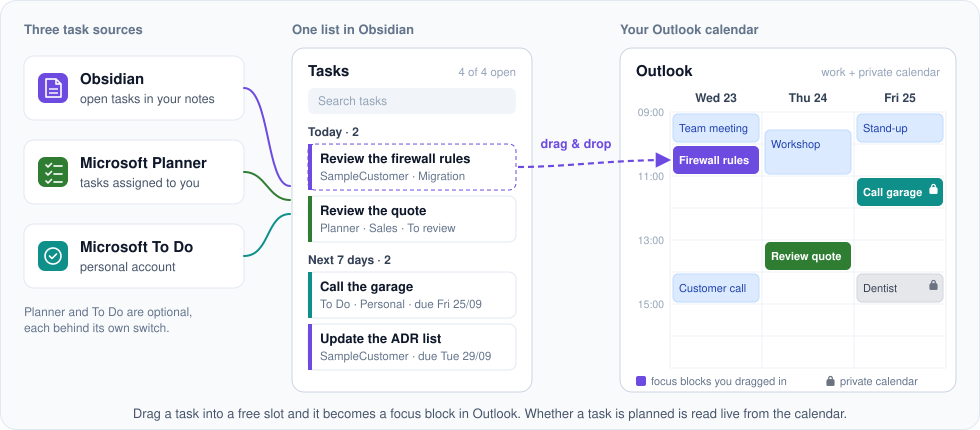

# Vault Planner

An Obsidian plugin for planning your day: your open tasks on the left, your Outlook week on the
right. Drag a task into a free slot, and a focus block appears in Outlook.

**Three task sources in one list:**

-  **Obsidian** — the open tasks from your project notes, in the format of the Tasks plugin.
-  **Microsoft Planner** — the tasks assigned to you (work account), with plan and bucket. Complete
  them or move them to another bucket without leaving Obsidian.
-  **Microsoft To Do** — your personal tasks (personal Microsoft account). Their blocks go into your
  private Outlook calendar, which the grid shows next to the work calendar.

Planner and To Do are optional, each behind its own switch.

The plan lives **only in Outlook**. For an Obsidian task the plugin writes a block id
(`^t-3f9a1c`) to the task line once, so the event can find its task again; Planner and To Do tasks
are linked by their id. Whether a task is planned is read live from the calendar, also after you
have moved or deleted a block in Outlook.

## Setup

### 1. Entra app registration (once)

1. Entra admin center → App registrations → **New registration** "Obsidian Vault Planner",
   *Accounts in this organizational directory only*. For To Do with a personal account this is
   changed later (Setup step 5).
2. **Authentication → Add a platform → Mobile and desktop applications**, with two custom redirect
   URIs:
   - `obsidian://vault-planner-auth`
   - `http://localhost` (spare)
3. "Allow public client flows" stays at **No**.
4. **API permissions → Microsoft Graph → Delegated:** `Calendars.ReadWrite` and
   `MailboxSettings.Read` (only for the colours of the Outlook categories), plus `Tasks.ReadWrite`
   for Planner tasks or To Do. If user consent is blocked, grant admin consent.
5. No secret, no application permission.
6. Note the **Application (client) ID** and the **Directory (tenant) ID**. They go into the plugin
   settings, not into the repository.

### 2. Test vault (once)

1. Download `release/test-vault.zip` and unpack it **outside OneDrive** into an empty folder, e.g.
   `C:\dev\test-vault`. Afterwards `10_Kunden` sits directly in that folder. Delete an older copy
   first: unpacked over it, renamed files exist twice and so does every task.
2. In Obsidian: *Open another vault → Open folder as vault*.
3. Settings → Community plugins → turn on, install **Tasks** in the same version as in the live
   vault, and copy its `data.json` over from
   `<live vault>/.obsidian/plugins/obsidian-tasks-plugin/`.

### 3. Install or update the plugin (every new build)

1. Download `release/vault-planner.zip`.
2. Unpack it into `<vault>/.obsidian/plugins/`. The zip contains the folder `vault-planner/` with
   `main.js`, `manifest.json` and `styles.css`. Overwrite existing files.
3. Settings → Community plugins → turn **Vault Planner** off and on again.
4. Compare the version shown (`0.1.0-dev.<timestamp>`) with the build's.

### 4. Sign in

Settings → Vault Planner: enter the **Tenant id** and **Client id**, then **Sign in**.
The **Planner tasks** switch adds the Planner tasks assigned to you. If consent for it is missing,
the plugin signs out after you switch it on; **Sign in** asks for it. If you cannot consent, switch
it off again and sign in anew. Switching it off stops requesting `Tasks.ReadWrite`, but does not
revoke consent once granted. Only Entra or myapps.microsoft.com can do that.

Since M7 the plugin also requests `MailboxSettings.Read`. After the first update to it, it signs
out once for that reason; **Sign in** asks for consent.

- The browser opens the Microsoft sign-in and asks at the end whether it may open Obsidian.
- While signing in, keep only **one** vault with the plugin open: the `obsidian://` link goes to
  the vault window that was active last.
- The sign-in lasts about 90 days from last use on this device. The token is stored encrypted in
  Obsidian's keychain, not in the vault.

### 5. Personal account for Microsoft To Do (optional, in progress: M9)

The same app registration as for the work account, opened to personal accounts:

1. **Authentication → Supported account types:** "Accounts in any organizational directory and
   personal Microsoft accounts". This opens the app to every Entra tenant; nobody gets at your data
   through it, and other tenants see it as "unverified". If Entra refuses the change, first change
   the property the error message names; the docs say this can be necessary.
2. **API permissions → Microsoft Graph → Delegated:** `Tasks.ReadWrite` and `Calendars.ReadWrite`
   must be in the list, even without Planner.
3. In the plugin, switch on "To Do (personal)", click **Sign in** for the personal account and
   consent with the personal account. The client id is the same.

A problem with the personal account never signs the work account out. Switching it off hides To Do
and the private calendar, but does not sign the personal account out.

## Usage

- **Open:** the calendar icon in the left ribbon, or the command "Open Vault Planner".
- **List:** grouped by date:
  - "Overdue": oldest date on top
  - "Today"
  - "Next 7 days"
  - "Later"
  - "No date"
  - plus "Waiting for" for `WAITING`, collapsed

  The date is `📅`, or `⏳` where `📅` is missing. The card shows which: "due Tue 22/09" or
  "⏳ Wed 08/07". A planned task moves up to the day of its next block: planned for today, it is
  listed under "Today". A block never pushes a task later; an overdue task stays overdue. On the
  same date the higher priority comes first; its symbol stands before the title.

  Search, the customer filter and "unplanned only" sit above the list. A click opens the task in a
  new tab.
- **Colours:** card and block of a vault task have the accent colour; for Planner tasks they are
  green. Your own blocks are filled. Other events are lightly tinted in the colour of their first
  Outlook category, blue without a category, and hatched when they are "tentative".
- **View:** the buttons above the calendar on the right switch between 1, 2, 3 or 4 work days, the
  work week and the full week with the weekend. In the day views the arrows page by as many work
  days as are visible. The choice is remembered on this device.
- **Plan:** drag a card into the calendar. A block is one hour long; dragging its edge changes the
  length. The card shows "Saving…" until the event appears in the calendar.
- **Move or resize:** drag the block in the calendar, or drag its edge.
- **Delete a block:** right-click the block → "Delete block…".
- **Complete:** the checkbox on the card (through the Tasks plugin). The blocks stay in Outlook;
  booked time is history.
- **Past:** a task whose blocks are all over shows "past: …" and counts as unplanned again.
- **Planner tasks** are listed under the customer "Planner", with plan and bucket. "Urgent" and
  "Important" from Planner count as important. A click opens the task in Planner, a right-click
  moves it to another bucket, the checkbox completes it in Planner. If it is also assigned to
  others, a dialog asks first, because it is then completed for everyone. Planner is read every
  minute and on returning to the view (at most every 30 s).
- **To Do tasks** (personal account, switch "To Do (personal)") are listed in turquoise under the
  customer "To Do", with the list as the project. Flagged emails are left out; "Waiting on others"
  and "Deferred" are listed under "Waiting for". A click opens the task in To Do, the checkbox
  completes it there. In a shared list a dialog asks first. Recurring tasks have no checkbox for
  now; tick them off in To Do.
- **Private calendar:** with "To Do (personal)" the grid also shows the events of your private
  calendar, grey with a lock. A dragged To Do card always lands in the **private** calendar,
  wherever in the grid you drop it; vault and Planner tasks always in the work calendar. You move,
  resize and delete private blocks like the others. Once the task is ticked off, its block turns
  pale with a check mark.

## What the plugin writes to the vault

Exactly two things, and only when you trigger them:

1. **Block id:** on the first booking it appends `^t-xxxxxx` to the end of the task line. It is
   never changed. It stays when you reword or move the task; when you copy or split it, only the
   original keeps it.
2. **Complete:** the Tasks plugin rewrites the line, for `🔁` with the next occurrence above it.

Nothing else: no `⏳`, no date, no event id, no writing in the background. Booking a Planner task
writes nothing to the vault.

## What the plugin writes to To Do

Exactly one thing, and only when you trigger it: completing a task. No other value, no new task, no
move to another list.

## What the plugin writes to Planner

Exactly two things, and only when you trigger them: completing a task and moving it to another
bucket. If someone has changed the task in Planner in the meantime, the plugin stops and reads
again instead of overwriting the change.

## Troubleshooting

| Message | Cause | Fix |
| --- | --- | --- |
| "The redirect URI does not match" (AADSTS50011) | `obsidian://vault-planner-auth` is missing or under the wrong platform | Add it under "Mobile and desktop applications" |
| "Entra expects a client secret" (AADSTS7000218) | The app is treated as a confidential client | Set "Allow public client flows" to Yes |
| "The app was not found" (AADSTS700016) | Wrong client id or tenant id | Compare with the registration's overview page |
| "Personal account: the app registration is not open to personal Microsoft accounts" | The registration's account type is still "Accounts in this organizational directory only" | Setup step 5, item 1 |
| "Consent is missing" (AADSTS65001) | User consent is blocked | Grant admin consent |
| "Conditional Access blocks …" (AADSTS53003/53000) | A CA policy applies | Look up the policy in the sign-in logs |
| "This response belongs to no pending sign-in" | The link went to another vault window, or Obsidian was restarted | Keep only one vault open, "Sign in" again |
| "Calendar unreachable – planning status unknown" | Network or Graph trouble | "Retry"; dragging is blocked until then |
| "No open tasks" although the vault has tasks | `10_Kunden` and `20_Intern` are not directly in the vault folder, e.g. one level deeper after unpacking | Move the folders up one level, then turn the plugin off and on |
| "Personal account: No access to To Do" | `Tasks.ReadWrite` is missing from the app registration or not consented for the personal account | Add the permission, sign the personal account out and in again |
| "No access to Planner" | `Tasks.ReadWrite` is missing from the app registration or not consented | Add the permission, sign out, sign in again |
| "… changed in Planner in the meantime" | The task was changed in Planner since the plugin read it | Try again after the reload |
| All other events blue although they have categories in Outlook | The category list was not readable (`MailboxSettings.Read` missing or not consented), or the category is new | Add the permission, sign out, sign in again; a new category shows once the view is reopened |
| "Duplicate block id" on a card | A line with `^t-…` was copied | Remove the block id from the copy |
| Dashed block with "Task not found" | The task line with this block id no longer exists | Delete the block with a right-click, or restore the id |

## Limitations

Desktop only, main window only (no pop-out), default calendar only. The weekend only in the "Week"
view.
No attendees, no events without a task. From Planner only Basic plans: the API does not return
Premium plans.
Built for one vault and one user: tasks come only from `10_Kunden/` and `20_Intern/`, and all times
are Europe/Berlin (`src/config.ts`).

## Development

See `CLAUDE.md` and `docs/implementation-plan.md`. In short: `npx npm@11 install`, then
`bash scripts/verify.sh`. The run ends with `release/vault-planner.zip`.

## License

MIT, see `LICENSE`.

Obsidian, Microsoft Outlook, Microsoft Planner and Microsoft To Do are trademarks of their
respective owners. Their icons in `docs/icons/` are used unmodified to name the products; Vault
Planner is not affiliated with or endorsed by them.
