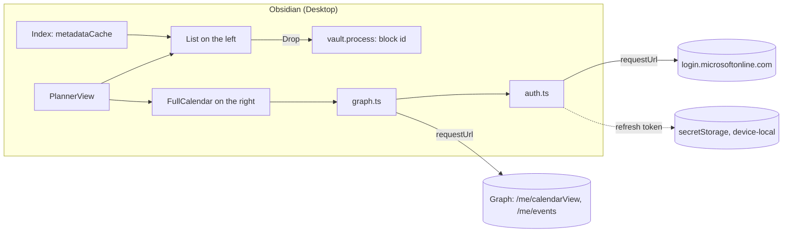

# Implementation plan v2: Obsidian plugin "Vault Planner"

> **As of 2026-09-24.** Replaces the draft `neuer_umsetzungsplan.md` (v1). Written for Claude
> Code on the Linux host. Building and testing happen there; the plugin runs on the Windows laptop.
> Code, comments, commits and (since 2026-10-01) UI texts in English. Before each milestone, read the whole
> section; the pitfalls are the part that saves the most time.

## Context

Planning has so far failed because tasks and calendar live in two separate interfaces. The
Obsidian plugin "Day Planner" is broken when deleting and sluggish when moving. The goal is **one**
Obsidian view: on the left the open tasks from the vault's project files, on the right the
Outlook work week. Dragging a task into the calendar creates a focus block in Outlook.

The plan takes its yardstick from the web app daily-planner: **In the morning, review the open
tasks in under two minutes, drag the relevant ones into free calendar gaps, done. Whatever does not
speed up this routine stays out.**

Draft v1 was checked against three sources:

1. **The web app** `github.com/dani3lh3pe/daily-planner` (as of `59acb7c`, M0–M14). Same idea,
   same user, same tenant, same Graph interface. Its `CLAUDE.md` invariant "The calendar is the
   truth" and its skill `.claude/skills/graph-calendar/SKILL.md` are experience paid for in
   production.
2. **Primary sources** on the Obsidian API, the Tasks plugin, FullCalendar and Entra (section
   "Verified facts"), plus the installed FullCalendar 6.1.21 source.
3. **An independent review** of this plan. It mainly found gaps in concurrency that React had
   silently covered in the web app.

**Result:** The draft's goal is right. But its data model mirrors the calendar into the vault via
`⏳` and creates exactly the drift the web app forbids. On top of that, half of its Graph details
contradict verified pitfalls. Both are corrected below, and the scope is cut.

## Implementation status (2026-09-24)

- **M6 (Planner) done as code (2026-09-28)**, not yet checked on Windows.
- **M8 (list by date) done as code (2026-09-29)**, not yet checked on Windows.
- **M7 (presentation) done as code (2026-09-28).** Seen on Windows: sign-in with
  `MailboxSettings.Read`, the week with `categories` in the `$select`, the list and the view
  buttons. The rest of the table "Verification M7" is open.
- **Done as code:** M0 (the repo part: scaffold, gate, test vault, skills), M1–M4. `bash
  scripts/verify.sh` is green, 145 tests. The build is in `release/vault-planner.zip`.
- **An independent review** against the source of FullCalendar 6.1.21 and `obsidian.d.ts` found
  one serious and ten smaller gaps, all fixed. The serious one (ghost block) is in the pitfall
  table of M4.
- **Done live (2026-09-30):**
  - M0.1: The Entra app works; the work and the personal account both sign in.
  - M1.0: The extended property comes back with `$select`; planned blocks show up as own
    blocks.
- **Open, only verifiable on Windows:** M0.2 (Tasks settings, global filter) and the manual
  verifications M1–M4, M6–M8 and M9.1a. Daniel reported "everything works", but not which rows he
  checked.

## Decisions (settled with Daniel, 2026-09-24)

| Question | Decision |
| --- | --- |
| Data model | **The calendar is the truth.** Neither the vault nor `data.json` holds a `⏳`, a date or an event id. Whether a task is planned is derived from the calendar on every load. Claude does not need the planning |
| Task source | Only project and customer files: every `.md` under `10_Kunden/` or `20_Intern/` whose name matches the folder it is in. Meeting notes and everything else stay out |
| Sign-in | OAuth auth code + PKCE in the system browser, without a secret, lean and self-built (no MSAL) |
| Entra app | Its own registration "Obsidian Vault Planner". The web app's registration (SPA, "Allow public client flows = No") stays untouched |
| Development | **On the Linux host**, in its own repo `~/dev/personal/obsidian-vault-planner`, as with entra-pim-manager: build, tests and package run here. Every verify run produces `release/vault-planner.zip`. Daniel downloads the file and unpacks it on the Windows laptop into the test vault's plugin folder. The live vault only comes in M5 |
| Dropped | New-task modal, Delete key, category "Vault" plus `🟣` prefix, adjustable splitter |
| Foreign events | Are shown but not editable. Without them there are no gaps |
| Completed tasks | Their blocks stay in Outlook, because booked time is history (rule of the web app). They can be deleted from the block's context menu |

## Corrections to the draft

| # | Draft | Now | Why |
| --- | --- | --- | --- |
| 1 | `⏳` = earliest future block, maintained by a SyncService, event cache in `data.json`, daily ±30-day run and orphan list | Dropped entirely. The status is derived | A second storage location drifts (invariant of the web app). Every sync would be a background write to vault files that Claude edits in parallel, and `⏳` would change just because time passes. Phase 6 of the draft exists only to repair this drift |
| 2 | Read with `Prefer: outlook.timezone` | Read in UTC, with a single parse point `fromGraphUtc` | The header changes the response but not the window parameters: an asymmetry within one request (graph-calendar skill: "do not re-attempt") |
| 3 | No `Prefer: IdType="ImmutableId"` | On **every** event request and every page | Standard IDs change when an event is moved between folders. Rule of the skill, costs nothing |
| 4 | POST without `transactionId` | With `crypto.randomUUID()` per POST | Protects against a POST being repeated at the transport level (such as a silent resend over a stale connection). It does not help against the **double drop**, because every drop is its own transaction. The saving mark protects against that (concurrency, rule 3) |
| 5 | `$select` without `responseStatus` | With it; `declined` blocks no time | Otherwise declined events stand as walls in the grid |
| 6 | Category "Vault" and `🟣` prefix as marker | Only the extended property | In the web app you had the category removed. The property cannot be clicked away in Outlook |
| 7 | Device code flow | Auth code + PKCE | Microsoft recommends blocking device code "wherever possible". Since 2025 the managed policy "Block device code flow" blocks it by default in tenants that have not used it for 25 days |
| 8 | Refresh token via `saveLocalStorage` | `app.secretStorage`: encrypted via Electron safeStorage since 1.11.5 (DPAPI on Windows), device-local, not synced | `saveLocalStorage` stores in plain text. The token opens the calendar for 90 days |
| 9 | Three retries with backoff on 429/503 | No retry. A notice instead; "Retry" only reads again, never writes | One user: a button is more honest than a hidden wait (skill, "Rejected") |
| 10 | Offline, the calendar shows the last state | Clear the events, hide the status, block the drop, banner "planning status unknown" | Stale events make a plausible but wrong plan (web app M3/M4) |
| 11 | Optimistic temporary event | First `info.revert()`. The card shows "Saving…", the grid comes only from Graph | Web app M1.4. The replacement logic goes away, and so does the duplicate bug that Full Calendar Remastered still has today (#338) |
| 12 | Refresh every 5 min | Every 15 s while the view is visible, and immediately on return | The real routine is: briefly to Outlook and back (web app `cdb88d7`) |
| 13 | Grid fixed from 06:00 to 20:00 | `visibleHours`: 07–19 as the minimum, extended to the week's events | Web app `e9f3d97`: an event at 06:15 was missing, the morning looked empty |
| 14 | Groups I&U, Urgent, Important, Rest; `urgentDays` 3 | The web app's groups: I&U, Important, Urgent, Rest. Urgent means deadline ≤ today + 7 (inclusive, Berlin day). Plus "Waiting for", collapsed | This is how you already group every day. Changeable as a constant in one line |
| 15 | "Use" the Tasks API, otherwise own `[ ]→[x]` | `executeToggleTaskDoneCommand` is a pure string function (since Tasks 7.2.0) and returns only text, which the plugin writes itself. Without the Tasks API there is no completing | A self-built tick-off loses the follow-up task on `🔁` without anyone noticing |
| 16 | Conflict check: line at the cached number == `raw` | Find the line in the **current** content by block id or unique raw text, otherwise abort | Claude and LiveSync insert lines above it. Then the number shifts, the text does not |
| 17 | 13 settings | Only `tenantId` and `clientId`, everything else as a constant in `src/config.ts`. Since M6 the Planner switch joins them | One user, one vault |
| 18 | Banner "N plans expired" plus "Back to backlog" (removes `⏳`) | Status "past" (all blocks over, task open). It is shown and counts as unplanned. No button | Without `⏳` there is nothing to remove. Planning again or letting the week pass resolves the state by itself |
| 19 | Popover for foreign events, "Open in Outlook", "Complete task" in the block menu, refresh button | Block menu with "Open task" and "Delete block…", foreign events get a tooltip | None of this speeds up the morning routine. Completing sits on the card, refreshing runs by itself |
| 20 | Auth only in phase 3 | In M1, together with reading the calendar | Risk first: the unknowns are the tenant policy and FullCalendar in Obsidian, not the task list |
| 21 | Example line `… 📅 2026-09-25 ➕ 2026-09-24 ([[…capture]])` | The triage rule puts the source link **before** the emoji fields; existing lines are cleaned up once (M5) | Tasks reads the line "backwards from the end", and only block links and tags are allowed after the fields. With the link at the end, `📅` **and** `➕` are invisible. That breaks the draft's own rule from section 1.2 |
| 22 | Vault `CLAUDE.md`: "Vault Planner manages `⏳`" | Dropped. The rules on block id and indentation remain (the one on effort is gone since M8) | There is no `⏳` any more |
| 23 | ESLint | No linter. The gate is `tsc` in strict mode | As in the web app |
| 24 | Non-goal: planning recurring tasks | Works without a special case | On completion the block id stays on the completed line; the follow-up task gets none (Tasks source `createNextOccurrence`: `blockLink: ''`). The next time it is planned it gets its own. Forbidding it would need code, allowing it does not |

## Invariants

They are in `CLAUDE.md`, section "Invariants", and are maintained only there. The numbers this
plan refers to are the ones there.

## Architecture

### Overview

One plugin with one `ItemView`, without a UI framework. The interface is built with Obsidian's
DOM helpers `createEl`, `Menu`, `Modal`, `Notice` and `setIcon`.



**Stack:** TypeScript strict and esbuild from `obsidian-sample-plugin`, tested with vitest.

**FullCalendar** is pinned **exactly** to **6.1.21** (`@fullcalendar/core`, `/timegrid`,
`/interaction`, all MIT), as in the web app. v7 has been out since 2026-06 but is deliberately
left out:

- the packages have different names there,
- the CSS is no longer injected automatically,
- `temporal-polyfill` is mandatory,
- and the web app's options apply to v6.

**`minAppVersion` is 1.12.2**, for two reasons:

- from 1.11.5 on, Obsidian encrypts the SecretStorage,
- from 1.12.2 on, `obsidian://` links work even without the CLI enabled.

The live vault runs on 1.13.x.

### Data model

**Task line.** The plugin only appends the block id:

```markdown
- [ ] Update the ADR list ⏫ 📅 2026-09-28 ^t-3f9a1c
```

- **Block id:** `^t-` plus 6 characters `[a-z0-9]`. It is set on the first drop and never
  changed. If the line already has a block id (say from "Copy link to block"), **that one** is
  used.
- **Effort:** Removed since M8. Until then the parser read `[aufwand:: 2h]` (draft,
  decision 2) as the drag duration. Now every block is `BLOCK_DURATION` long, one hour, and only
  `cleanTitle` hides old values. The POST uses the `end` that `eventReceive`
  delivers.
- **Customer and project:** The customer is the first folder under `10_Kunden/`; for `20_Intern/`
  it is "junis intern". The project is the file's folder, unless it is the customer itself.
  Example: `10_Kunden/<C>/<C>.md` gives customer C without a project, `10_Kunden/<C>/<P>/<P>.md`
  gives customer C, project P.
- **WAITING:** The description starts with `WAITING`.

**Outlook event** (`POST /me/events`, with `Prefer: IdType="ImmutableId"`):

```jsonc
{
  "subject": "<cleaned description, max. 255>",
  "start": { "dateTime": "<toWallClock(start)>", "timeZone": "W. Europe Standard Time" },
  "end":   { "dateTime": "<toWallClock(end)>",   "timeZone": "W. Europe Standard Time" },
  "showAs": "busy", "isReminderOn": false, "transactionId": "<uuid>",
  "body": { "contentType": "text",
            "content": "Focus block from Obsidian\nCustomer: …\nProject: …\nobsidian://open?vault=…&file=…" },
  "singleValueExtendedProperties": [
    { "id": "String {<GUID>} Name vaultTaskId", "value": "<vaultName>|t-3f9a1c" }
  ]
}
```

- **`<GUID>`:** generate it once and keep it as a constant in `src/config.ts`.
- **`<vaultName>`:** this is `app.vault.getName()`. The test vault and the live vault share the
  same calendar, and neither may take the other's blocks for its own.
- **Never send `attendees`**, not even an empty array.

**What lives where:**

- `data.json` holds only `tenantId` and `clientId`.
- **Device-local** are the refresh token in `app.secretStorage` (ID
  `vault-planner-refresh-token`) and the account's display name in `app.saveLocalStorage`.
- The access token exists only in memory.

### Planning status (derived, never stored)

**Status window:** from Monday of the **current** week, 00:00, to 14 calendar days later. It is
computed with date arithmetic, not in milliseconds, so the switch to summer time does not
interfere.

**What is loaded** is the envelope of the displayed week and the status window, with a single
`calendarView` call. Each part sees only its own slice of it:

| Who | Sees |
| --- | --- |
| FullCalendar | only the displayed week |
| `visibleHours` | only its events |
| Status | only the events in the status window |

So paging to other weeks never changes the status. A task booked for Wednesday stays "planned",
even while you plan next week.

`deriveSchedule(events, vaultName, now)` collects the non-cancelled events whose property value
is `<vaultName>|<blockId>` into a `Map<blockId, Block[]>`, sorted by start. Per task:

| Status | Condition | Card status line | With "unplanned only" |
| --- | --- | --- | --- |
| planned | a block with `end > now` (future or running right now) | next block, e.g. "Wed 10:00–11:00"; with a date outside the current week | hidden |
| past | blocks in the status window, all with `end ≤ now` | "past: Mon 10:00", dimmed | visible |
| unplanned | no block in the status window | – | visible |

- **Ready:** The calendar is *ready* when you are signed in and the last read for the current
  range succeeded. Only then does the following hold:
  - Drops are allowed.
  - Status lines are visible.
  - "unplanned only" is active.

  Otherwise "planning status unknown" is shown above the list.
- **Task not found:** If an own block finds no task line, it still stays an own block. It keeps
  the border in its source's color, shows "Task not found" and can be deleted from its menu.
  For this the index knows the block ids of **all** task lines in the source files, completed ones
  too. The hint only appears once the index is complete (M2.2).
- **Duplicate block id:** If a block id is in more than one task line (a copied or split line;
  Obsidian keeps block ids unique only per file), that is a **conflict**.
  - Both cards show "Duplicate block id (file A, file B)" and cannot be dragged.
  - The related blocks show the same hint, and their menu offers only "Delete block…".
  - There is no "first wins", because the order in the index is not stable. Otherwise the second
    copy could never be planned.

### Concurrency (applies to M1–M4)

The web app got these rules for free from React effects. Vanilla code has to build them itself.
The pure logic lives in `lib/readGate.ts` and has a test.

1. **Reads are numbered.** Only the response of the most recently started one is applied. The
   15 s tick does not start a new one while one is running. A write always starts a new one
   afterwards, which makes the running one obsolete.
2. **Nothing is applied during a gesture.** If a response arrives while a block is being dragged
   or resized or a PATCH is running, it is **discarded**, not kept for later. After the gesture,
   a new read follows.
3. **"Saving…" is tied to the block id.** The mark starts right after the block id has been
   written. It ends only when the first read started **after** the POST finished has been applied
   or has failed. Until then the card cannot be dragged. So the status can never fall back to
   "unplanned" between "POST done" and "block visible", and nobody books
   twice.
4. **Every call has a 30 s timeout** (`Promise.race`, because `requestUrl` has none). If a POST
   does arrive after the timeout, the next read recognizes it by the property.
5. **Only one token refresh runs at a time.** Parallel callers wait on the same promise.
6. **Signed out means: no tick.** `getAccessToken()` then fails immediately, without a
   network call, and burdens neither the network nor the Entra sign-in logs.

### Taken from the web app (as of `59acb7c`, pure logic only)

| File in daily-planner | What is taken |
| --- | --- |
| `src/lib/time.ts` (+test) | Unchanged: `toWallClock`, `fromGraphUtc`, `plannerDay`, `formatSlot` (Berlin time), `aufwandToMinutes`, `aufwandToDuration`, `PROPOSED_AUFWAND` (the last three removed since M8) |
| `src/lib/calendar/mapGraphEvents.ts` (+test) | New is the field `vaultTaskId` from the first expanded property. Do not compare the property ID exactly, because the `$filter` has already selected |
| `src/lib/calendar/toFullCalendarEvents.ts` (+test) | Only the mapper: it recognizes own blocks by `vaultTaskId`, plus the variants "not found" and "conflict". **Not** taken are `blocksTime` and `blocksDay`, which only "Plan today" needs |
| `src/lib/calendar/visibleHours.ts` (+test) | Unchanged |
| `src/lib/calendar/reconcile.ts`, `followUp.ts` | Template for `deriveSchedule`, inverted: property instead of ID list |
| `src/lib/priority.ts`, `src/lib/taskSort.ts` (+tests) | Only `isUrgent`, `isOverdue`, `quadrantOf`, `groupByQuadrant`, the labels and the default sort. Important means 🔺 or ⏫, `/` replaces `inProgress`. **Not** `taskList.ts`: there the search looks only at the title, and "planned" there means "any block"; both contradict M2.3 |
| `src/lib/errors.ts` (+test) | Remove the Planner branch, add texts for network errors and timeout |
| `src/lib/graph/calendarRead.ts`, `calendarWrite.ts`, `odata.ts` | Behind a `requestUrl` adapter. `nextLink` is followed unchanged; the POST gains the property and the body |
| `src/config/calendar.ts`, `src/types/calendar.ts`, `src/types/graph.ts` | Constants and types |
| `CalendarPane.tsx`, `useTaskDraggable.ts`, `useCalendarWindow.ts`, `TaskCard.tsx` (`CLICK_SLOP_PX`) | Templates for options, flows and the 5 px click guard, built with the vanilla API (`new Calendar(el, opts)`) |
| `.claude/skills/graph-calendar/SKILL.md` | Copy into the plugin repo and adjust the file table. New Graph findings belong there |

Either set up the import alias `@/` in esbuild and tsconfig, or make the imports relative.

### Target structure

```text
~/dev/personal/obsidian-vault-planner/
├── CLAUDE.md                    Invariants, yardstick, commands, review levels, UX rules
├── manifest.json                id vault-planner, isDesktopOnly true, minAppVersion 1.12.2
├── package.json · esbuild.config.mjs · tsconfig.json · styles.css
├── scripts/verify.sh            Gate: tsc, vitest (TZ=UTC), build, package
├── scripts/package.mjs          release/vault-planner.zip and release/test-vault.zip
├── .claude/                     settings.json (Stop hook → verify.sh), skills/graph-calendar/
├── src/
│   ├── main.ts                  Plugin: view, ribbon, command, settings tab, protocol handler
│   ├── view.ts                  PlannerView: layout, list, calendar, menus, modals
│   ├── auth.ts                  PKCE sign-in, refresh, token storage
│   ├── graph.ts                 requestUrl adapter: read, create, move, delete
│   ├── vault.ts                 Index (metadataCache) and the two writes
│   ├── config.ts                All constants
│   └── lib/                     Pure logic with tests: the files taken over, and
│                                parseTask, taskLine, schedule, subject, readGate
└── test-vault/                  Throwaway vault; only the fixture notes are committed
```

Split `view.ts` only when it grows beyond about 400 lines, not before.

---

## M0 — Prerequisites (before the first line of plugin code)

**0.1 Entra app registration** (Daniel, Entra admin center):

- New registration "Obsidian Vault Planner", this directory only.
- Platform **"Mobile and desktop applications"** with two redirect URIs:
  - `obsidian://vault-planner-auth` as a custom redirect. Precedent: Remotely Save uses
    `obsidian://remotely-save-cb-onedrive` in production against Microsoft.
  - `http://localhost` as a fallback. Entra ignores the port for localhost.

  If the portal does not accept the `obsidian://` URI, the fallback applies from then on (M1.2).
- Delegated permission `Calendars.ReadWrite`. `openid`, `profile` and `offline_access` come along
  as OIDC scopes. Grant admin consent if needed.
- "Allow public client flows" stays at **No**. The platform already makes the app a
  public client; the switch is meant for flows without a redirect (device code, ROPC). If the
  token exchange reports AADSTS7000218 ("client_secret required"), set it to Yes.
- No secret, no application permission.

→ **verify:** The client id and tenant id are noted down, but **not in the repository**. They go
into the plugin settings.

**0.2 Read the live vault's Tasks settings**
(`.obsidian/plugins/obsidian-tasks-plugin/data.json`): global filter, custom status symbols,
position of new recurrences, version.

→ **verify:** The values are in the plugin's `CLAUDE.md`. If there is a global filter, it applies
in the parser too.

**0.3 Repo** under `~/dev/personal/obsidian-vault-planner` on the Linux host, following the pattern
of `obsidian-sample-plugin` (esbuild, `main.ts`, `manifest.json`), without its sample code:

- `manifest.json`: `id: vault-planner`, `name: Vault Planner`, `isDesktopOnly: true`,
  `minAppVersion: "1.12.2"`.
- FullCalendar in all three packages exactly `"6.1.21"`, without `^`.
- Install with `npx npm@11 install` instead of `npm install`, because the distro npm 9.2.0 is
  broken with Node 22 on the host (as in daily-planner).
- vitest with `"test": "TZ=UTC vitest run"` as in the web app, plus a guard test
  `new Date(0).getTimezoneOffset() === 0`. **No ESLint.**
- `CLAUDE.md` with the invariants, the yardstick sentence and the web app's UX rules: loading
  state, errors in plain language, a confirmation dialog before anything destructive, feedback via `Notice`.
- Copy the graph-calendar skill and register `scripts/verify.sh` as the Stop hook.

→ **verify:** `bash scripts/verify.sh` is green and produces `release/vault-planner.zip`.

**0.4 Test vault** `test-vault/` in the repo:

- It has the real folder structure and one fixture file per case (list in M2.1).
- `scripts/package.mjs` packs it as `release/test-vault.zip`. Daniel downloads the file **once**
  and unpacks it on the laptop outside OneDrive.
- There, not in the repo, the Tasks plugin is added in the same version as in the live vault,
  together with a **copy of its `data.json`**: the output on completion depends on the settings.
- **Every new version** reaches the laptop like this:
  1. Download `release/vault-planner.zip`.
  2. Unpack it into `<test vault>/.obsidian/plugins/`. The file contains the folder
     `vault-planner/` with `main.js`, `manifest.json` and `styles.css`.
  3. Switch the plugin off and on again in the settings.

  The zip carries a build id in `manifest.json` (`0.1.0-dev.<timestamp>`), visible under
  Settings → Community plugins.

→ **verify:** Obsidian opens the test vault, the plugin can be enabled, and the build id shown
is the newest.

| Pitfall | Countermeasure |
| --- | --- |
| Reusing the web app's SPA registration | Don't. An SPA redirect requires an `Origin` when redeeming (AADSTS9002327), and `requestUrl` sends none. With `fetch` it would work, but SPA refresh tokens last only 24 h |
| Developing against the live vault | Never before M5. LiveSync spreads a bug in the write path to all devices at once, and Claude reads it too |
| Overlooking the Tasks global filter | Step 0.2. Otherwise the Tasks API ticks such lines off without a done date |
| `npm i @fullcalendar/core` installs 7.x (now `latest`), which does not fit `timegrid`/`interaction` 6.1.21 | Pin exactly and commit the lockfile |
| Unpacking the test vault under "Documents" or "Desktop", which Known Folder Move redirects into OneDrive | Choose a folder outside OneDrive, e.g. `C:\dev\test-vault`, otherwise OneDrive syncs it too |
| Testing a stale version | Every verify run rebuilds the zip and stamps the build id. Check the id in the settings before every test |

## M1 — Vertical slice: view, sign-in, reading the calendar (the risk block)

**Goal:** The Outlook work week appears correctly in an Obsidian view, and the sign-in
survives a restart.

**1.0 Live probe** (five minutes in Graph Explorer, Daniel, in parallel with development here):

1. `POST /me/events` with `singleValueExtendedProperties` (test value) and
   `Prefer: IdType="ImmutableId"`. The response does **not** contain the property; that is
   documented and fine.
2. `GET /me/calendarView?…&$expand=singleValueExtendedProperties($filter=id eq '…')`, **with exactly
   the `$select` from 1.3**. Does the property come along? **How own blocks are recognized
   depends on this.**
   - Microsoft documents `$expand` only for single events. A Microsoft employee confirms
     it for `calendarView`; another report sees the property vanish together with `$select`.
   - If it is missing only with `$select`, drop `$select`.
   - Note the casing of the property ID that comes back.
3. **Leave** the test event in place until 1.3, then `DELETE` it twice: does the second call answer
   with 404?
   - A PATCH proof is not needed. The plugin stores no event IDs; an ID changed by the
     PATCH would simply arrive with the next read.

→ **verify:** The results are in the plugin repo's graph-calendar skill, dated and marked
"verified live". If point 2 fails, stop and decide anew, do not improvise. The fallback
would be to fetch own blocks separately via `/me/events` with a `$filter` on the property; that
works because own blocks are never series.

**1.1 View scaffold** (`main.ts`, `view.ts`):

- `registerView`, ribbon icon `calendar-check` and command "Open Vault Planner". The command
  reveals an existing leaf via `await workspace.revealLeaf()`, otherwise it opens a new tab.
  - Since 1.7.2 a restored leaf can be "deferred". So check `leaf.view instanceof PlannerView`
    before accessing it.
- **Layout** as a CSS grid: list `minmax(320px, 38%)`, calendar `1fr`. Both columns get
  `min-height: 0`, so that FullCalendar has a height with `height: 100%`.
- **Cleanup:** `onResize()` calls `calendar.updateSize()`, `onClose()` calls `calendar.destroy()`
  and `draggable.destroy()`.
- **Interval, DOM listeners and workspace events** are registered on the **view**
  (`this.registerInterval`, `this.registerDomEvent`, `this.registerEvent`), not on the plugin.
  Otherwise the tick keeps running after closing and calls a destroyed calendar.

**1.2 Sign-in** (`auth.ts`):

- **`login()`** creates `code_verifier` (32 random bytes, base64url), `code_challenge`
  (base64url(SHA-256) via `crypto.subtle`) and `state`. Then it opens, via `window.open` in the
  system browser:
  `…/{tenant}/oauth2/v2.0/authorize?client_id&response_type=code&redirect_uri&scope&code_challenge&code_challenge_method=S256&state&prompt=select_account`
- **Way back:** `registerObsidianProtocolHandler("vault-planner-auth", …)`, once in `onload`,
  because a second registration throws. `obsidian://vault-planner-auth?code=…&state=…` becomes
  `{ action, code, state }`.
  - Check the `state` first, then exchange the code: `POST …/token` via `requestUrl`,
    `application/x-www-form-urlencoded`, `throw: false`.
- **Scopes:** `openid profile offline_access https://graph.microsoft.com/Calendars.ReadWrite`, since M7
  plus `MailboxSettings.Read`, with Planner `Tasks.ReadWrite` (`scopes()` in `src/config.ts`). The
  display name is `preferred_username` from the ID token and goes device-locally into
  `saveLocalStorage`. No `GET /me`.
- **Storage:** `app.secretStorage.setSecret("vault-planner-refresh-token", rt)`. On sign-out,
  overwrite it with `""`; there is no public `deleteSecret`.
- **`getAccessToken()`:**
  - The access token lives in memory and is renewed five minutes before it expires.
  - **Every** new refresh token is stored immediately.
  - Only one refresh runs at a time, since M6 one per scope.
  - The function **never** opens the browser.
  - On `invalid_grant` or `interaction_required` the state switches to "signed out": the tick
    stops, and a banner "The sign-in has expired" offers "Sign in".
  - Every sign-in and sign-out bumps a generation number. A refresh still running at that moment
    no longer stores its token and does not delete a new sign-in.
- **Settings tab:** `tenantId`, `clientId`, "Sign in"/"Sign out" and the signed-in account.

→ **verify:** Sign in, then restart Obsidian. The settings still show the account, and
`data.json` contains no token.

**1.3 Reading the calendar** (`graph.ts`, `lib/`): take over `calendarRead.ts`, `odata.ts`,
`mapGraphEvents.ts`, `time.ts` and the constants. The adapter:

- **Headers** on every request: `Authorization` and `Prefer: IdType="ImmutableId"`. It follows
  `@odata.nextLink` unchanged; do not append the query options again.
- **First URL:**
  - `$select=id,subject,start,end,isAllDay,isCancelled,showAs,responseStatus` (or without it, see
    1.0)
  - `$expand=singleValueExtendedProperties($filter=id eq '…')`
  - `$top=250`, `MAX_EVENT_PAGES=10`
  - Built with `encodeURIComponent`, **not** with `URLSearchParams`, because that encodes
    spaces as `+`.
- **Range:** the envelope of the displayed week and the status window.
- **Responses:** timeout 30 s. Read `.text` and parse only if the text is not empty. On 401,
  renew once and retry.

→ **verify:**

- `mapGraphEvents.test.ts` is extended with the property, plus a test on the generated URL.
- The probe event from 1.0 arrives in the plugin's own read with `vaultTaskId`.

**1.4 FullCalendar** (`view.ts`); the options come from `CalendarPane.tsx`:

- **Imports:** `import enGbLocale from "@fullcalendar/core/locales/en-gb"`, then `locale: enGbLocale`
  (until 2026-10-01 `de`, the same way). A bare code string finds no loaded locale, and texts and
  week rules fall back to `en` (`queryLocale` in `@fullcalendar/core`).
- **View:** `timeGridWeek`, `timeZone: "local"`, `firstDay: 1`, `weekends: false`,
  `allDaySlot`, `nowIndicator`, `expandRows`, `height: "100%"`, `businessHours` Mon–Fri 08–17,
  `headerToolbar` "prev,next today | title".
- **Grid:** `slotDuration 00:30`, `snapDuration 00:15`. `slotMinTime` and `slotMaxTime` come
  from `visibleHours` over the displayed week's events and are set only when the
  value changes.
- **Drop gate:** `eventAllow: (span) => ready && !span.allDay`. **`droppable: false` does not block
  drops from the list.** In the 6.1.21 source, external drops check only `dropAccept` and
  `isInteractionValid`, i.e. `eventAllow` (`interaction/index.js:1829–1832`). The same gate
  also stops an own block from moving into the all-day row.
- **Events:**
  - Replace them as a whole, but only when something has changed: remove the fixed event source
    and add it again, inside `batchRendering`. No function source.
  - Foreign events go through the `toFullCalendarEvents` mapper and are not editable.
    `free` and `workingElsewhere` appear as background, cancelled and declined ones not at all.
- **`styles.css`:** map the `--fc-*` variables to Obsidian variables, scoped to
  `.vault-planner-view`.

**1.5 Refresh and errors:**

- **When:** every 15 s while you are signed in and the view is visible
  (`document.visibilityState`, `containerEl.isShown()`). Also immediately on return, triggered
  by `visibilitychange`, `focus` on `window` and `active-leaf-change` to this leaf.
  `visibilitychange` alone does not fire reliably when switching back from Outlook.
- Read sequence as in "Concurrency". A loading indicator appears only on the first load.
- **Errors:** The events are cleared, and `ready = false`. A banner "Calendar unreachable –
  planning status unknown" offers "Retry" (only reads again). The texts
  come from `errors.ts`.

| Pitfall | Countermeasure |
| --- | --- |
| `requestUrl` throws from status 400 on and loses the body with the AADSTS or Graph codes | `throw: false` everywhere, evaluate the status yourself |
| `response.json` throws on the empty body of a 204, and header names arrive in lower case | Read `.text` and parse only if the text is not empty |
| `requestUrl` knows neither timeout nor abort | 30 s timeout and numbered reads (concurrency, rules 1 and 4) |
| `fetch` instead of `requestUrl` | Sends `Origin` and leads to CORS or AADSTS9002326 (invariant 5). If the token exchange reports 9002326 despite `requestUrl`, only the token request goes through Node `https` |
| Graph returns `dateTime` without `Z` | A single parse point that checks `timeZone === "UTC"` and rejects anything else (taken over) |
| `Prefer` header only on the first page | The adapter sets the headers on every request, `nextLink` included |
| `URLSearchParams` encodes spaces in the `$expand` filter as `+` | `encodeURIComponent`, plus a test on the URL and the probe from 1.0 |
| Without a `vault` parameter, an `obsidian://` link goes to the most recently focused vault window | Keep only one vault with the plugin open while signing in. A `state` without a pending sign-in yields a notice, nothing else. If need be, switch to `http://localhost` with a one-off Node `http` server on `127.0.0.1` |
| Every refresh returns a new refresh token with a fresh 90-day lifetime | Always store the newest. Conditional Access (sign-in frequency) can shorten the lifetime |
| `Draggable` listens on the global `document`, and v6's CSS injection fails in a foreign document (FullCalendar #7301) | The view runs only in the main window. In a popout a notice appears instead of the calendar |
| `datesSet` fires without a range change, which turns into a fetch loop | Do nothing if the start is the same (web app M1.4) |
| `locale` as a bare string (`"de"`, now `"en-gb"`) | Texts and week rules silently fall back to `en`. Import the locale object |
| 2–10 s of Graph latency leave the area empty | A loading hint with a fixed height above the grid (UX rule 1) |

**Verification M1** (manual):

| Action | What it proves |
| --- | --- |
| Sign in: browser, SSO, back to Obsidian | Redirect, PKCE and token exchange without `Origin` work |
| Compare the week with Outlook (all-day, declined, "free", series) | The UTC read path, series expansion and the reading of `showAs` are right |
| Create an event at 06:15, wait up to 15 s | `visibleHours` extends the grid, and the tick runs |
| Switch to Outlook, change something there, come back | The view reads again immediately (`focus`) |
| Restart Obsidian | The refresh token is stored device-locally, no browser opens |
| Search `data.json` | There is no token in the vault |
| Wi-Fi off | Banner "planning status unknown", empty grid, no drop possible |
| Close the view, watch the console | No tick keeps running |
| Sign-in logs in Entra | The sign-in succeeded, Conditional Access does not block |
| Light and dark theme | Readable in both |

## M2 — Task index and list (read only)

**Goal:** All open tasks of the project and customer files appear, correctly grouped.
Changes appear in under a second after Obsidian has saved.

**2.1 Parser** (`lib/parseTask.ts` + test), pure and with the semantics of the Tasks plugin. Tasks
reads "backwards from the end of the line" and stops at the first unknown value.

- **Field regexes** taken from the Tasks source (MIT, with a source reference in the comment), not
  rebuilt. They include:
  - an optional U+FE0F after every symbol,
  - `📆` and `🗓` as variants for due, `⌛` for scheduled,
  - `🏁`, `🆔` and `⛔` (since Tasks 6.1.0).
- **Sequence:**
  1. First split off the block link at the end (pattern `/ \^[a-zA-Z0-9-]+$/`, i.e. with a space
     before it).
  2. Then read the fields from the end until none matches. Tags may sit in between.
  3. The rest is the description. Tasks rewrites in its own order on completion,
     so the parser must be able to read any order.
- **Result:** status, description, priority, `due`, `isRecurring`, `blockId`, effort (in
  hours, removed since M8; `scheduled` from `⏳` instead) and `isWaiting`. Plus customer and project from the path, by the source rule.

Fixture lines (also in the test vault):

- the three examples from the draft, plus the same line with the source link before the fields
- `[aufwand:: 90m]` and `[aufwand:: 1.5h]` (since M8 only for title cleanup)
- an existing `^t-…` and a foreign `^abc123`
- `🔁 every week` before and after `📅`
- `[/]`, `[x] … ✅`, `[-]`
- 🔺 and 🔽
- a symbol with U+FE0F
- a tag between the fields, emoji and umlauts in the description
- an indented ```yaml``` block and an indented sub-task
- a file with `\r\n`

→ **verify:** The table test is green. Each fixture line is also cross-checked in the test vault
with a Tasks query: same `due`, same priority.

**2.2 Index** (`vault.ts`):

- **Build** in `workspace.onLayoutReady`: per source file `getFileCache(file).listItems` with
  `task !== undefined`. `position.start.line` is 0-based. `cachedRead` supplies the text.
- **Updates via `metadataCache.on("changed", (file, data, cache) => …)`:** Use exactly this
  `data` and this `cache`. Read separately, the two can come from different file
  versions, and then the line numbers do not match. Plus `vault.on("delete")` and
  `vault.on("rename")`. Redrawing is debounced by 300 ms.
- **Complete** is the index after the metadataCache's first `resolved` event. Before that
  there is neither "Task not found" nor the empty state.
- **Status characters:** Obsidian treats every character except `' '` as done. So the parser
  decides what "open" means: `' '`, `'/'` and custom characters from 0.2.
- **Content:** The index holds `Map<blockId, TaskRef[]>` for all task lines, completed ones included.

**2.3 List** (`view.ts`):

- **Groups** from `priority.ts`: "Important & urgent", "Important", "Urgent", "Rest", then
  "Waiting for" as a collapsed `<details>`. **Grouped by date since M8**, see there.
- **Sort** within each group: `due` ascending (no `due` last), then `[/]` before `[ ]`, then the
  description by `de` collation. Since M8 `⏳` counts as a fallback, and priority comes before `[/]`.
- **Card:**
  - Description.
  - Line 2: "Effort · Customer · Project · due `due`", overdue in red **and** bold. Since M8 without effort.
  - Status line, only when the calendar is ready.
  - Checkbox, active from M4.
  - Conflict cards show the conflict hint instead.
- **Controls:** search over description, customer and project, customer dropdown, "unplanned only"
  (disabled while the calendar is not ready). The controls sit **outside** the
  container that is rebuilt.
- **Rebuild** only when a cheap signature of the list has changed (status texts
  included). Then restore `scrollTop` and `details.open`.
- **Click** opens the file in a **new tab** at the line (check: `openFile` with
  `eState.line`) and never replaces the planner leaf. A click counts only if the mouse has moved
  less than 5 px since `mousedown`, like `CLICK_SLOP_PX` in the web app. Otherwise a
  drag pulled back would open the file.

| Pitfall | Countermeasure |
| --- | --- |
| `getFileCache` is empty at startup for freshly synced files | Skip them. The following `changed` delivers them later. "Complete" only after `resolved` |
| Task-like lines in code blocks | Count only `listItems` with `task`, no own regex over the file |
| "No open tasks" while the index is still building | Empty state only once the index is complete |
| Deadline compared via UTC instead of the Berlin day | `plannerDay(now)`. The tests run under `TZ=UTC` and catch it |
| A symbol with U+FE0F, as Claude may write it | Ends field parsing early, due slips into the description, the task lands in the wrong group. Take over the Tasks regexes, fixture |
| Every tick and every vault change resets the scroll position, `<details>` and the search focus | Signature, controls outside, restore the state |
| "Under a second" measured from the keystroke | Obsidian saves only about 2 s after the last keystroke. Measure from the save; do not "speed it up" with editor listeners |

**Verification M2** (manual):

| Action | What it proves |
| --- | --- |
| Change a task in the editor | After saving, the change is in the list in under a second |
| Change a file outside Obsidian (like Claude's triage) | The index follows via `metadataCache` |
| Rename a file, then delete it | The tasks move along or disappear |
| Create a meeting note with `- [ ]` | The line does **not** appear |
| Scroll down, open "Waiting for", wait 15 s | Scroll position and `<details>` are kept |

## M3 — Planning by drag and drop (the first write path)

**Goal:** Dragging a task to Wed 10:00 creates an Outlook event 10:00–11:00 with the property
(until M8 as long as the effort). The task line has only gained `^t-…`.

**3.1 Draggable** (template `useTaskDraggable.ts`):

- Exactly one `new Draggable(listScrollEl, { itemSelector: ".vp-card[data-drag]", eventData })`.
- **What a card carries:** `data-path`, `data-raw` (the raw line, without the line number),
  where applicable `data-block-id` and `data-title`. Since M8 the duration is no longer on the card:
  `eventData` passes a fixed `BLOCK_DURATION` (one hour), and without it the drop would have no end.
- `data-drag` is missing while the card is saving or has a block id conflict.
- **The checkbox** stops `mousedown`, `touchstart` and `click`. FullCalendar starts the drag via
  `mousedown`/`touchstart` on the container (`interaction/index.js:119–120`); stopping `pointerdown`
  does not help.
- **The drag preview** is a copy of the card in `document.body`. So `.vp-card` needs
  a standalone style, not just one under `.vault-planner-view`.

**3.2 `eventReceive`:**

1. First read `start` and `end` from `info.event`.
2. **Then** `info.revert()`.
3. If the calendar is not ready, a notice appears and nothing else happens. That is the second
   door; the first is `eventAllow`.

**3.3 Ensure the block id** (`lib/taskLine.ts` pure, plus `vault.ts`):

1. Save open `MarkdownView`s of the same file with `await view.save()`.
2. Then `vault.process`, and inside it:
   - split the lines, keeping the line ending,
   - find the target line by `data-block-id` or unique `data-raw`,
   - `ensureBlockId(line)`: reuse an existing id or append a space plus
     `^t-xxxxxx`, after a collision check against the index.
3. If the line cannot be found or is ambiguous, the notice "The task has changed in the
   meantime – please drag it again" appears. Then there is **no** POST.
4. Right after that, the saving mark for this block id starts (concurrency, rule 3).

**3.4 POST** via `calendarWrite.createBlocker`, extended with property and body. The order is
block id first, then the event. If the POST fails, an unused block id remains, and that is
harmless. The other way round would leave an orphaned event.

**3.5 Feedback:** The card shows "Saving…". On success a notice "Event
created: Wed 10:00–11:00." appears, then a new read. The mark ends per rule 3.
Errors appear in plain language from `errors.ts`.

**3.6 Rendering** (`lib/schedule.ts` + test):

- `deriveSchedule` as above.
- Own blocks appear filled in their source's color **with an icon** (since M7: vault in the
  accent color, Planner green), are editable and have visible handles.
- "Task not found" and "conflict" are dimmed and carry a hint.

| Pitfall | Countermeasure |
| --- | --- |
| A second drop before the first is visible | Saving mark on the block id until the first read started afterwards. A stale card without an id fails at the raw text search |
| The card key is path plus line number | Claude inserts a line above it, and the drop hits a different task. Hence raw text instead of the number |
| `droppable: false` does not stop the drop onto an empty, not-ready grid, and that leads to double bookings | `eventAllow` (1.4), plus the second door in 3.2 |
| A drop into the all-day row creates a block at 00:00 (gap in the web app) | `eventAllow` rejects `allDay` |
| `start`/`end` read only after `revert()` | Read them before |
| The line already has a block id | Reuse it, never append a second one |
| A copied line with the same block id | Conflict as in "Planning status", no "first wins" |
| The file has `\r\n` (written by Claude or Python) | Keep the line ending, with fixture and test |
| A copy of the task line is in a code block of the same file | `locateLine` skips code blocks (```` ``` ````/`~~~`), like the index. Otherwise the copy would get the block id |
| Daniel types in the open file and drags before the editor has saved | First `view.save()`, then `vault.process`. Otherwise the editor's later save overwrites the block id, or the keystrokes get lost |
| The temporary event stays next to the real one (Full Calendar Remastered #338) | `info.revert()` first, the grid comes only from Graph |
| The subject is too long or contains links, `[aufwand::]` or `WAITING` | `lib/subject.ts` + test |
| Test blocks in the real calendar | The vault prefix separates them from the live vault. Delete them after verification |

**Verification M3** (manual):

| Action | What it proves |
| --- | --- |
| Drag a task with ⏫ 📅 to Wed 10:00, open Outlook on the phone | Day, time and duration are right, no reminder sound, no invitation. Time zone chain and body are correct |
| Compare the line in the test vault with the fixture in the repo | At the end of exactly this line there is `^t-…` with a space before it, nothing else |
| A Tasks query on the line | Due and priority are still recognized |
| Reload Obsidian | The block is recognized as an own block (property round trip) |
| Move the block in Outlook, wait up to 15 s | The card shows the new time, the project file stays unchanged (modified date in Explorer). The calendar is the truth |
| Delete the block in Outlook | The task is unplanned, the line unchanged |
| Drag a task without an id, and drag it again while "Saving…" shows | Not draggable, or the hint "changed in the meantime". Exactly one event is created |
| Book Wednesday, page to next week | The card still shows "planned" |
| Drag with Wi-Fi off or after a failed read | The drop is rejected, nothing is written |
| Copy a line with `^t-…` into another project file | Both cards show the conflict, neither is draggable |
| Drag a task (since M8 there is no effort any more) | 60 min |
| Type into the line, drag within 2 s, wait 5 s | The line contains the text **and** `^t-…`, the block is recognized |
| Drag a task with a link and umlauts | The subject is cleaned, the umlauts are right |

## M4 — Moving and deleting blocks, completing tasks

**4.1 Moving and resizing** (`eventChange`, template `CalendarPane.tsx`):

- `PATCH` with only `start` and `end` (`moveBlocker`).
- At most one PATCH per event, otherwise `revert()` and the notice "The event is being
  moved right now."
- On an error, `revert()` and the message in plain language. The all-day row is already blocked by
  `eventAllow`.
- Then read again, as in "Concurrency". Nothing is written.

**4.2 Context menu of own blocks:** In `eventDidMount`, set a `contextmenu` handler with
`preventDefault` that opens an Obsidian `Menu`.

- "Open task", if the block id resolves uniquely.
- A separator, then "Delete block…". This opens a `Modal` with the task title and time span. Then
  follow `DELETE` (404 counts as success), a new read and a notice.
- Foreign events have no menu, but subject and time as a tooltip.

**4.3 Completing** (checkbox on the card):

1. Save open editors of the file (as in 3.3).
2. Then, in **one** `vault.process`: find the current line and apply
   `apiV1.executeToggleTaskDoneCommand(line, path)` to it synchronously (since Tasks 7.2.0).
   Split the returned text at `\n` and join it again with the file's line ending. It
   replaces exactly the target line; indented lines below it stay.
   - With `🔁` there are two lines, by default the new recurrence **above** the completed one.
     The block id stays on the completed line.
3. Return value equals input: abort as an error.
4. Empty return (`🏁 delete`): write nothing. Notice "Please complete this task in the
   editor", because otherwise its indented lines would hang on the previous task.
5. If the API is missing (`app.plugins` is not public API, so narrow via `unknown`): notice
   "Completing a task needs the Tasks plugin", write nothing.

The blocks stay.

**4.4 Live proof via the plugin path:** Leave the delete dialog open, delete the same event in
Outlook, then confirm in the plugin. That must pass as a success, without an error message
(404 = success). Then switch "NOT verified" to "verified live" in the graph-calendar skill and
record why the PATCH proof was dropped.

| Pitfall | Countermeasure |
| --- | --- |
| A read resets a block in the middle of a PATCH | Concurrency, rule 2, and one PATCH per event |
| **Ghost block:** FullCalendar starts a drag only after 5 px (`eventDragMinDistance`). A read in between replaces the event source under the pressed block, and on release FullCalendar re-inserts the old copy. The duplicate block stays visible until the view is reopened (found in the review, `interaction/index.js:1246–1286`, `core:3547`) | `eventDragMinDistance: 0`: the gesture opens on the mouse press already, and `renderCalendar` waits |
| Completing by block id finds a line that was just ticked off in the editor. Toggling would reopen it | Check before toggling that the line is still open, otherwise abort |
| The Tasks API writes nothing, returns lines with `\n` or none at all | The plugin writes itself and sets the file's line ending. Tests for "two lines in a `\r\n` file" and "empty" |
| Right-click shows Electron's native menu | `preventDefault` in the `contextmenu` handler |
| The block of a completed task cannot be deleted (gap in the web app) | The index also knows completed block ids, and the menu is attached to the block |
| Deleting without confirmation | A real `Modal` with the name (UX rule 3), never `confirm()` |

**Verification M4** (manual):

| Action | What it proves |
| --- | --- |
| Drag a block to another day in the plugin | Outlook shows the new day, the file is unchanged |
| Extend a block at its edge | The duration in Outlook is right |
| Delete a block via the menu ten times in a row | Each time the event is gone and the task is unplanned afterwards (the Day Planner failure) |
| The same offline | Notice, the block stays, nothing is half deleted |
| Complete a normal task via the checkbox | Tasks sets `[x]` and `✅ <today>`, the card disappears, the blocks stay |
| Complete a recurring, planned task | The follow-up task sits correctly above it, without a block id. The old block hangs on the completed line |
| Create a second block for the same task, delete the first | The card shows the remaining block |

## M6 — Planner tasks (behind a switch)

**Goal:** The Planner tasks assigned to me are in the same list. They can be
planned, ticked off and moved to another bucket. Switched off, the plugin behaves as
before M6.

**Decisions (with Daniel, 2026-09-28):**

- Ticking off and moving to another bucket work in the plugin.
- The customer filter has an entry "Planner"; the plan shows as the project on the card.
- If the task is assigned to several people, the card shows the count. Names would need
  `User.ReadBasic.All` and are therefore missing.

The model is the web app's Planner path (M13, `briefing.md` §12).

**6.1 Sign-in** (`auth.ts`, `lib/oauth.ts`):

- The switch `plannerEnabled` is in the settings, off by default.
- Switched on, `Tasks.ReadWrite` joins the scope of sign-in and refresh.
- The access token remembers its scope; after toggling, a new exchange happens.
- If consent is missing, the refresh fails with AADSTS65001. The plugin signs out, and
  "Sign in" obtains the consent.
- Deliberately one token for both: a second token path only for Planner would be more code than the
  whole read path. The price: without consent the plugin signs out, for the calendar too. Whoever
  cannot consent switches Planner off and signs in again. Staying signed in would mean
  writing a failing token exchange into the sign-in logs every 15 s.

**6.2 Reading** (`graph.ts`, `lib/planner.ts`), on its own 60 s tick. A 429 from
Planner must not take the calendar down with it.

- `GET /me/planner/tasks`, follow `@odata.nextLink` (at most 10 pages), without
  `$select`/`$filter`. A `$select` would drop the etag that every write needs.
- For every plan with an open task:
  - `GET /planner/plans/{id}` for the title, remembered for the session.
  - `GET /planner/plans/{id}/buckets` on every read, sorted by `orderHint`, ordinal.
- Mapping:
  - `priority` 0–1 → 🔺, 2–4 → ⏫, otherwise not important.
  - `dueDateTime` → Berlin day.
  - `percentComplete` 1–99 → "in progress", 100 → done.
  - `assignments` → number of other people.
- Completed tasks stay in the model, so that their blocks have a title.
- Errors: a hint above the list; the calendar and vault tasks stay untouched; there is
  no retry. If only one plan fails (say a team you have left), only its
  title and buckets are missing; the tasks stay visible.
- On return to the view, say from Planner web, Planner is read immediately, at most
  every 30 s. A running read is not discarded; only a write and the
  switch force a new one.
- More than 10 pages (completed tasks count too) produce a hint instead of a silently
  truncated list.
- After a write, the card shows "Saving…" until a read started afterwards
  shows a **different** etag; Planner can lag behind its own writes. Otherwise a second click
  could only earn a 412.

**6.3 Planning:** as in M3, but **without** writing to the vault.

- The property carries `planner:<taskId>`, **without** the vault name: a Planner task is the same
  in every vault, and the test and live vault share one calendar. With the vault name, a block booked
  in the test vault would show as a foreign event in the live vault. Block ids (`[a-zA-Z0-9-]`) and
  Windows folder names contain no colon, so there is no confusion with
  `<vault>|<blockId>`.
- The subject is the title; the body names the plan and the Planner link.

**6.4 Ticking off and moving to another bucket** (the two Planner writes):

- `PATCH /planner/tasks/{id}` with `If-Match` = etag of the last read, body
  `{ "percentComplete": 100 }` or `{ "bucketId": … }`.
- If the task is assigned to other people too, a dialog asks first.
- 412 means someone changed the task in Planner: notice, read again, **never** retry automatically
  with the fresh etag.
- The blocks stay.

**6.5 Interface:**

- The card shows "Planner · plan name · bucket" and, where applicable, "with N other people" (until M8 with "Effort?" in front).
- A click opens the task in Planner in the browser.
- Right-click opens a menu with "Open in Planner" and the plan's buckets; the current one is
  ticked.
- "Open task" on the block also opens Planner for Planner blocks.

| Pitfall | Countermeasure |
| --- | --- |
| Reading a missing priority as important | The default is 5 ("medium"). Only 0–4 is important (web app M13) |
| Taking the date prefix of `dueDateTime` | It is a point in time (Planner web sets 10:00Z). `fromGraphUtc` and `plannerDay`, otherwise a due date near midnight lands a day off |
| PATCH without `If-Match` | Mandatory. A task without an etag is dropped and counted, instead of silently not completing |
| Retrying a 412 with a fresh etag | That overwrites exactly the change that caused the conflict |
| Planner on the calendar's tick | A 429 from Planner would take the calendar with it. Own tick, own error state |
| Sorting `orderHint` with `localeCompare` | The documented comparison is ordinal, character by character |
| `Prefer: IdType="ImmutableId"` on Planner too | That is a calendar header. Planner requests do not get it |

**Open, only verifiable live:**

- Does `Tasks.ReadWrite` need admin consent? The permissions reference says no,
  the web app noted yes.
- Does `https://tasks.office.com/{tenantId}/Home/Task/{taskId}` open the task? The web app only
  assumed so.
- Does `/me/planner/tasks` paginate?
- According to the docs, the API does not return tasks from premium plans.

**Verification M6** (manual):

| Action | What it proves |
| --- | --- |
| Switch on, watch Obsidian | Either it keeps running (consent is there) or the sign-out with a hint comes; "Sign in" obtains the consent, then the tasks appear |
| Compare the list with "Assigned to me" in Planner | Title, due date, priority (urgent/important) and plan are right, completed ones are missing |
| A task due today and an overdue one | Both under "Urgent", the overdue one in red |
| Drag a Planner task, reload Obsidian | The block is an own block, the card "planned", nothing changes in the project file |
| Click the card | Planner opens exactly this task (link format) |
| Right-click → choose another bucket | In Planner the task is in the new bucket, the card shows it |
| Tick off a task assigned only to you | Completed in Planner, the card disappears, the block stays |
| Tick off a shared task | First the dialog with the count, then as above |
| Change the task in Planner, then tick it off in the plugin within 60 s | Notice "changed in Planner", nothing overwritten, the list reads again |
| Switch off | The Planner cards disappear, vault and calendar keep running, Planner blocks stay in the grid |

## M7 — Presentation: colors and views

**Trigger (2026-09-28):** On the first screenshot with Planner almost everything looked the same. Foreign
events were almost white on white, today's column had the same color as the
non-working hours, and all cards were the same grey. Decided with Daniel:

- category colors from Outlook;
- color cards and blocks by source;
- the views 1–4 days, work week and week;
- paging by N working days.

**Rule:** Per surface, color encodes exactly one thing, and color is never the only signal.

| Surface | Color | Second signal |
| --- | --- | --- |
| Foreign event | lightly tinted in the first Outlook category, blue without a category; hatched if tentative | Title |
| Own block | filled in the source: vault in the accent color, Planner `oklch(0.52 0.12 155)` (from daily-planner) | Icon |
| Card | tinted in the source, with an edge stripe | "Planner" in the meta line |
| Group title | edge mark red, orange, yellow, grey (since M8: by date, plus pale for "No date") | Title text |

**7.1 Category colors** (`graph.readCategoryColors`, `lib/mapGraphEvents.ts` + test):

- `categories` goes into the `$select`.
- `/me/outlook/masterCategories` is read on opening and after sign-in.
- According to the docs, the new permission `MailboxSettings.Read` needs no admin consent. The rules are in the graph-calendar skill.
- If reading fails, the base color stays, without a banner: it is decoration, not planning status.

**7.2 List:**

- Date "due Tue 22/09" in the style of the status line, with the year only outside the current year (`formatDue`).
- "Effort?" pale (removed entirely since M8).
- Bucket as a chip.

**7.3 Views:**

- FullCalendar views with `dayCount` (counts only visible days) and `weekends: true` for the week.
- Own arrows with `shiftWorkdays`, because FullCalendar moves a `dayCount` view by only one day.
- The choice is stored per device in `app.saveLocalStorage`.

| Pitfall | Countermeasure |
| --- | --- |
| Taking the categories' hex values as verified | Graph gives only names, the color depends on the client. The table in `styles.css` is an approximation |
| `dateIncrement: N days` for the day views | Over the weekend a day repeats (Thu, Fri, Mon → Mon, Tue, Wed). `shiftWorkdays` counts working days |
| Style definition only under `.vault-planner-view` | The card's drag preview hangs in `<body>`. So `--vp-planner` is on `body` and the card color on `.vp-card` |
| State rules before the source colors | "Task not found" would turn green instead of dashed. The rules for missing and conflict come after them |
| A typo like `📅 2026-13-01` in the date formatting | Intl throws, and list and calendar stay empty on every render. Whatever is not a real date stays as written |
| Free time with the category stripe | Would look like an event. Background bands get only the tint |
| Dark presets in the dark theme | Black on black. Under `.theme-dark` every category color is lightened by 30 % |

**Deliberate (with Daniel, 2026-09-28):** `MailboxSettings.Read` is in the same token as the
calendar. If consent is missing, the plugin signs out and shows no calendar until it is
granted. Unlike with the Planner switch, there is no way out via a setting. Daniel
manages the Entra app himself, and a switch would be one more setting.

**Verified live (2026-09-28):** calendarView accepts `categories` in the `$select`, and the sign-in with
`MailboxSettings.Read` went through.

**Open, only verifiable live:** Is an event with a category really colored, i.e. is
masterCategories readable? An error there shows no banner, only blue. Did the consent come as a
user, or did it need admin consent?

**Verification M7** (manual):

| Action | What it proves |
| --- | --- |
| Add `MailboxSettings.Read` in Entra, reload the plugin | The "Sign in" banner appears, the consent names the mailbox settings, then the calendar is there: scope and user consent |
| Give an event a category in Outlook, reopen the view | The event roughly carries the Outlook color, one without a category is blue, a tentative one hatched |
| Plan one vault task and one Planner task | The block is purple or green, matching the card |
| Click through the buttons 1–4, Work week and Week | The 3-day view pages Mon–Wed → Thu, Fri, Mon, the week shows Sat/Sun, after a restart the view is back |
| Drag into the 1-day view and onto a Saturday | The block is created in the new views too |
| Dark theme | Tinted events, green blocks and cards stay readable |

## M8 — List by date instead of by quadrant

**Trigger (2026-09-29):** In the morning Daniel wants to see what is overdue and what is due next.
The Eisenhower groups assume maintained priorities, and most tasks have none.
Also, the imports in the live vault have only `⏳` and no `📅`, so until now no date at all. Decided with
Daniel:

- five groups: Overdue, Today, Next 7 days, Later, No date;
- read `⏳` as a fallback;
- priority as a secondary criterion with a mark on the card;
- dragging within the list only later.

**8.1 Date** (`lib/parseTask.ts`, `lib/priority.ts` + tests):

- The parser reads `⏳` as `scheduled`.
- The list date is `📅 ?? ⏳` (`listDate`). A past `⏳` is overdue; the card says "⏳ Wed 08/07" instead of "due …".
- `⏳` is never written, and it is not planning status (invariant 1, CLAUDE.md "Tasks plugin").

**8.2 Order:**

- First the list date, then the priority (🔺 ⏫ 🔼 none 🔽 ⏬), then `[/]` before `[ ]`, then the text.
- The priority stands as a Tasks symbol before the title. Planner "urgent" and "important" appear as 🔺 and ⏫.

| Pitfall | Countermeasure |
| --- | --- |
| Reading `⏳` as planning status | It is only a list date. "planned" still means: a block in the calendar |
| Sorting a task with `📅` and `⏳` by `⏳` | `📅` wins. `⏳` counts only where `📅` is missing |
| Without quadrants, the priority disappears | Secondary sort criterion and a symbol on the card |

**8.3 Effort is dropped (2026-09-29):** Daniel does not use it; it was oversized. The plugin
no longer reads `[aufwand::]`, every block is one hour long (`BLOCK_DURATION`), and the card
no longer shows "Effort?". `cleanTitle` still hides old values in the lines from the title and
the Outlook subject. The vault's triage routine may still write them; the
vault `CLAUDE.md` governs that, not this repo.

**8.4 Planned moves up (2026-09-29):** Daniel dragged a task without a date to today; it stayed
under "No date". Now the list date is the earlier of the task's own date and the day of the
next block (`buildList`, derived from the loaded calendar like the status, invariant 1).
A block never moves a task back: overdue stays overdue, due today stays today. Once
the block is over ("past"), the task's own date applies again.

**Open:** What should dragging a card within the list change: priority, date or only
the order? Every variant that writes into the task extends invariant 2 or 7. Daniel decides
once he has used the new list for a while.

**Verification M8** (manual):

| Action | What it proves |
| --- | --- |
| Open the list | The groups are in the order Overdue, Today, Next 7 days, Later, No date, and the title marks are red, orange, yellow, grey, pale |
| Look at "Scheduled with hourglass only" in the test vault | The task is under "Overdue" and shows "⏳ Wed 23/09" |
| Two tasks with the same date, one of them ⏫ | The ⏫ task comes first and carries the symbol before the title |
| A Planner task with priority "Urgent" | It carries 🔺 |
| Drag a task without a date to today | It moves to "Today" as soon as the calendar has been read again |
| Drag an overdue task to today | It stays under "Overdue", the status line shows the block |
| Drag "Update the ADR list" (has `[aufwand:: 90m]`) into the calendar | The block is one hour long, card and subject show no `[aufwand::]` |

## M9 — Microsoft To Do, personal account (in planning)

**Status:** grilling and spec finished (2026-09-29, spec in `.scratch/m9-todo/spec.md`, not
versioned).

- **M9.0:** the personal sign-in is verified live (2026-09-30). **Verified live (2026-10-01):**
  To Do tasks and recurring To Dos are recognized correctly, so `recurrence` comes along when
  reading the list. The probe report on `If-Match`, recurrence on completion and the filter
  is still missing.
- **M9.1a (To Do in the list):** done as code (2026-09-30), not yet checked on Windows.
- **M9.1b (private calendar):** done as code (2026-10-01). Daniel approved it without waiting for the
  probe report. **Verified live (2026-10-01):** Planning into the private calendar, recurring
  To Dos included, and moving work; the property comes back there. Meanwhile the
  banner "Personal account: Too many requests" was showing: all lists in parallel next to the private calendar
  exceed the four concurrent requests Outlook allows per app and mailbox. Since then
  `readTodo` reads the lists one after another; that the banner is gone is not yet checked.

**Verification M9.1b** (manual):

| Action | What it proves |
| --- | --- |
| "To Do (personal)" on, look at the week | Private events grey with a lock in the grid, the grid reaches the evening events |
| Drag a To Do card onto an evening | A turquoise block is created in the private calendar (Outlook.com), not in the work calendar, and the card shows it as planned: the property comes back in the private calendar. If the card briefly goes unplanned again after "Saving…", outlook.com lags behind the POST: report it, then the mark holds until the block is visible |
| Drag a To Do card into working hours | This block also lands in the private calendar |
| Drag one vault task and one Planner task | Both still land in the work calendar |
| Move, resize and delete the private block | The change appears in Outlook.com |
| Tick off the planned To Do task | The block stays, pale with a check mark, tooltip "Task completed or no longer in To Do" |
| Sign out the personal account | Private events disappear, To Do cards cannot be dragged, the work calendar keeps running |

**Verification M9.1a** (manual):

| Action | What it proves |
| --- | --- |
| Switch on "To Do (personal)" | Briefly "Loading To Do tasks…", then turquoise cards under "To Do", the list as the project; flagged emails are missing |
| A task with status `waitingOnOthers` or `deferred` in To Do | It is under "Waiting for" |
| Tick off a To Do task | Completed in To Do, the card disappears after "Saving…" |
| Tick off a task in a shared list | First the dialog with its title |
| A recurring task | A repeat icon instead of the checkbox (only if the probe shows that Graph returns `recurrence`) |
| Click a To Do card | To Do opens in the browser at the task (link format, spec no. 38) |
| Sign out the personal account | Hint "Personal account not signed in" with "Sign in", the To Do cards disappear, the rest keeps running |
| Switch off | To Do cards and hint disappear |

**M9.0 — Probe before building.** Built are the personal sign-in (authority `consumers`, its own
token, its own switch, routing back to the account whose sign-in is running) and a temporary
command "M9.0 probe: check the personal account". It shows a report to copy.

- **Preparation by Daniel:**
  - open the app registration to personal accounts (README, Setup step 5);
  - in To Do, two tasks: "M9-Probe einmalig" due tomorrow and "M9-Probe
    wiederkehrend" with a daily recurrence.
- **The probe checks:**
  - reading lists, recognizing flagged and shared lists;
  - whether `$filter=status ne 'completed'` is accepted (the docs only say "some OData parameters");
  - the due date as a Berlin day;
  - whether `If-Match` with a stale etag is rejected;
  - whether completing the recurring task creates the next occurrence;
  - in the private calendar, create a test event tomorrow at 06:00, find it again by property,
    move it (same ID?) and delete it.
- **The sign-in alone proves** the routing back via `obsidian://` for personal accounts. **Verified
  live (2026-09-30):** The personal account's sign-in via `consumers` with the shared
  registration comes back via `obsidian://`; the settings show the outlook.com account.
  The work sign-in stayed in place.

If it does not arrive, `http://localhost` is decided on before building (spec no. 33). The
answers go here and into the graph-calendar skill; then the probe command is removed.

**Deliberate (with Daniel, 2026-09-30, replaces the decision of 2026-09-29): one
app registration for both accounts.** Daniel switched the existing registration to "Accounts in
any organizational directory and personal Microsoft accounts". The personal account signs
in with the same client id, via the authority `consumers`, with its own refresh token and
its own switch with its own "Sign in". Entra has no account type "my tenant only plus personal
accounts".

- **Rejected (planned before):** a second registration "Personal Microsoft accounts only". It would have
  restricted the work app to the own tenant, but costs a setup step and a
  second client id. In return Daniel accepts that the app is open to every tenant.
- **Consequence:** The work sign-in runs unchanged via the tenant id. A consent or
  sign-in problem with the personal account still never signs out the work account and never blocks the
  calendar, because token and sign-in stay separate.
- **Cost:** Both accounts hang on one registration and one client id. Whoever reverts the account types,
  removes a permission or changes the client id hits both.

**Deliberate (with Daniel, 2026-09-29): personal To Dos go into the private calendar.** Daniel
mostly does them in the evening or at the weekend. So the plugin also reads the private calendar:
for the planning status (invariant 1), and so that the grid shows private events too. It writes
blocks there as in the work calendar.

- **Rejected:** all To Do blocks marked "private" in the work calendar. That would be about half
  the size and would block the time for colleagues too. But for tasks in the evening or at the weekend
  the block does not belong in the work calendar.
- **Consequence:** A block in the private calendar does not show Daniel as busy in the work calendar.

## M5 — Go-live in the real vault

**Moved up (with Daniel, 2026-09-30):** The plugin has been running in the real vault since 2026-09-29, before the
verification tables had passed. Daniel: "The real vault is no problem." Step 3 (zip before
the first write) came too late, because the first block id had already been written. Steps 1
and 2 and the verification tables remain open.

1. **Task format in the vault** (Daniel with Claude, can also happen earlier): The vault `CLAUDE.md` §3 and the
   triage routine put the source link `([[…]])` **before** the emoji fields. Existing lines with the
   link at the end are cleaned up once, with confirmation. → **verify:** A Tasks query shows
   the `📅` date for these lines.
2. **Extend vault `CLAUDE.md` §3:**
   - Never remove or change block ids `^…` at the end of a line, not even when rephrasing.
   - **When copying or splitting, only the original keeps the block id.**
   - Indented blocks under tasks stay unchanged.
3. **Back up:** the vault as a zip, as the state before the first write.
4. **Install:** only once all verification tables M1–M4 and M6 have passed on Windows, the
   `invariant-reviewer` reports nothing critical and Daniel explicitly agrees. If any of these
   is missing, say so and stop; a green gate replaces none of these points. Then
   unpack `release/vault-planner.zip` into `<live vault>/.obsidian/plugins/`, enter the settings,
   sign in. The test vault is closed meanwhile.
5. **README:** Entra registration (M0.1), Setup and Usage.
6. **Deactivate Day Planner.** `99_System/Daily` is no longer needed.

→ **verify:** One week of real use without data loss, with planning done only in the plugin. Plus a
comparison between the zip and the live files: every line that has since gained `^t-…` or a done date
differs from the state in the zip only in that. This separates Claude's own changes
from the plugin's.

**After the week:** What applies beyond M5 (the table "Verified facts", the pitfall tables) moves into
`CLAUDE.md` or a skill, and this plan is marked as historical. Without milestones
nobody reads it before a change any more.

## Verification (cross-cutting)

**Automatic:** `scripts/verify.sh` runs as the Stop hook (`tsc --noEmit`, vitest, esbuild build,
package). After every green run a fresh `release/vault-planner.zip` is ready.
Before multi-file commits, first `/ponytail-review`, then `/code-review`, at this level:

- **high** for M1.2 (auth), M3 and M4, i.e. everything that writes to Outlook or the vault
- **medium** for M1.3 (Graph read path) and M2.2 (index)
- **low** for pure UI

**Tests** (pure logic):

- the tests taken over from the web app and the TZ guard
- `parseTask`: the fixture table
- `taskLine`: append, reuse, `\r\n`, unique, ambiguous, missing, replacing two lines,
  empty return
- `schedule`: planned, running, past, unplanned, cancelled, foreign vault prefix, unknown
  block id, conflict, status window independent of the displayed week
- `readGate`: a stale response is discarded, a response during the gesture is discarded, the
  mark is released only after the follow-up read
- `subject`
- the Graph URL with `$expand` (`%20`, not `+`)

**Manual:** the tables of the individual milestones, i.e. only what automation does not
prove.

## Verified facts (research on 2026-09-24 against primary sources)

| Claim | Finding | Source |
| --- | --- | --- |
| `loadLocalStorage` / `saveLocalStorage` | Exist since 1.8.7, vault-specific, **in plain text** | `obsidian.d.ts` |
| Account types of an app registration (M9, 2026-09-29) | Four values: `AzureADMyOrg`, `AzureADMultipleOrgs`, `AzureADandPersonalMicrosoftAccount`, `PersonalMicrosoftAccount`. None is called "own tenant plus personal accounts". When switching, "you may need to change other properties first". With personal accounts: no query parameters in redirect URIs, at most 100 | learn.microsoft.com: Entra, "Validation differences by supported account types" and "Redirect URI best practices" |
| `app.secretStorage` | `setSecret`, `getSecret` and `listSecrets` since 1.11.4, encrypted (safeStorage) since 1.11.5, device-local. ID matching `^[a-z0-9-]+$`, at most 64 characters. Other plugins can read along; the value is visible under Settings → Keychain | d.ts, changelog 1.11.5, Obsidian code 1.13.7 |
| `requestUrl` | Throws from 400 on and loses the body. No `Origin`, header names in lower case, no timeout; `.json` throws on an empty body | d.ts, Obsidian code 1.13.7, Electron `url_loader` |
| `vault.process` | Atomic, the callback runs synchronously. The editor API is mandated only for the active note | d.ts, Plugin guidelines |
| Protocol handler | `obsidian://<action>?k=v` becomes `{ action, k }`. Without `vault` the link goes to the most recently focused window; a second registration throws; the fix came in 1.12.2 | d.ts, Obsidian code, changelog 1.12.2 |
| Obsidian version | Desktop 1.13.7 (2026-08-12), typings 1.13.2 | obsidian-releases |
| Tasks API | `executeToggleTaskDoneCommand(line, path): string` since 7.2.0, a pure string function: two lines with `🔁`, empty with `🏁 delete`. Currently 8.4.0 | `TasksApiV1.ts`, `ToggleDone.ts` |
| Tasks parsing | From the end of the line. After the fields only block links and tags, block link matching `/ \^[a-zA-Z0-9-]+$/` | Tasks docs "Order of metadata" |
| Recurrence and block id | The completed line keeps the id; the new recurrence gets none and by default sits above it | `Task.ts` `createNextOccurrence` |
| FullCalendar | v7 since 2026-06-19 (7.1.0), `@fullcalendar/core@latest` is 7.x. In v6.1.21: `droppable` is not checked for external drops, `eventAllow` is; the drag starts via `mousedown`/`touchstart`; `eventReceive` has `revert()`; the CSS is injected by itself | fullcalendar.io, source 6.1.21 locally, #7301 |
| Device code | Microsoft "recommends blocking device code flow wherever possible", plus the managed policy "Block device code flow" (2025) | Learn: Authentication flows, Managed policies |
| Public client redirects | A custom URI on "Mobile and desktop applications" is allowed (precedent Remotely Save), `http://localhost` with any port, PKCE without a secret | Learn: redirect URIs, auth code flow |
| AADSTS9002326 / 9002327 | `Origin` without an SPA redirect, or an SPA redirect without `Origin` | Learn: auth code flow |
| Refresh token | 90 days (SPA 24 h), every refresh returns a new one, the old one is not revoked | Learn: refresh tokens |
| Extended property | May be in the POST body, but the response does not contain it. `$expand` is documented only for single events; confirmed for `calendarView` via Q&A, one report sees it vanish with `$select` | Learn, Q&A 462964 / 1180665 |
| Web app code | `aufwandToMinutes(undefined)` gives 15 min, `formatSlot` computes in Berlin time, `blocksTime`/`blocksDay` is used only by `nextGap.ts` | `time.ts:93–95, 151–171`, grep |

**Provable only live**, so planned as probes:

- `$expand` together with `$select`, and DELETE 404: M1.0 and M4.4
- `obsidian://` redirect in the portal: M0.1
- Token exchange without `Origin`: M1.2. The successful exchange is the proof; no echo service
  is needed

## Deliberately left out

- **Dropped by the new data model:** `⏳`, SyncService, event cache and orphan list
  (invariant 1).
- **Not needed:**
  - New-task modal; Quick Capture covers that
  - Delete key; the menu is the way
  - a category on the block and `🟣` (categories of foreign events are only read, since M7)
  - Splitter
  - Retry and backoff; "Retry" only reads again
  - Popover, "Open in Outlook", refresh button
  - GUID check while typing, for two fields you fill in once
- **Portable later, if the need arises:**
  - "Plan today" with `blocksTime`/`blocksDay`: portable from `nextGap.ts` if dragging
    gets too slow.
  - Asking for the effort on drop, as in the web app's `AufwandDialog`. Instead 60 min apply, and
    you resize in the grid. Since M8 `[aufwand::]` is no longer read either.
  - A hint when the computer's time zone is not Berlin (web app `App.tsx:809–817`). When travelling,
    the grid (local) and the status lines (Berlin) then diverge.
- **Out of scope:**
  - Undo after completing
  - FullCalendar v7
  - Mobile, popout windows, several calendars, attendees, events without a task; the weekend only in
    the "Week" view (M7)

## Open, not blocking

- `urgentDays` is 7 (web app) instead of 3 (draft). Check after the first week.
- Should the plugin flag lines in which emoji fields sit in the middle of the description? Only
  if the cleanup from M5.1 is not enough.
