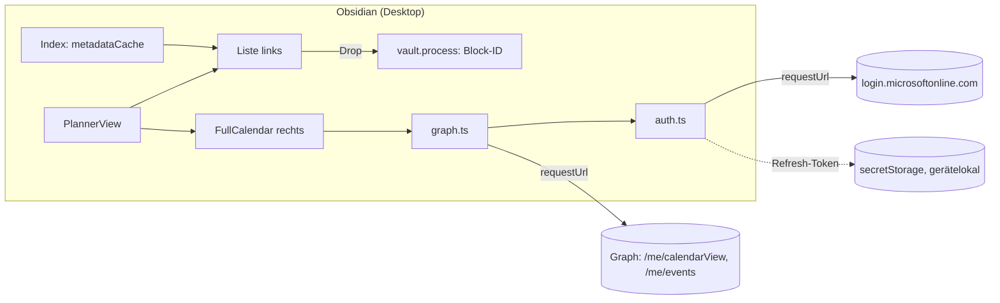

# Umsetzungsplan v2: Obsidian-Plugin „Vault Planner"

> **Stand 2026-09-24.** Ersetzt den Entwurf `neuer_umsetzungsplan.md` (v1). Geschrieben für Claude
> Code auf dem Linux-Host. Dort wird gebaut und getestet, ausgeführt wird auf dem Windows-Notebook.
> Code, Kommentare und Commits auf Englisch, Oberflächentexte auf Deutsch. Vor jedem Meilenstein
> den ganzen Abschnitt lesen; die Stolperfallen sind der Teil, der die meiste Zeit spart.

## Context

Die Planung scheitert bisher an zwei getrennten Oberflächen für Aufgaben und Kalender. Das
Obsidian-Plugin „Day Planner" ist beim Löschen defekt und beim Verschieben träge. Ziel ist **eine**
Obsidian-Ansicht: links die offenen Tasks aus den Projektdateien des Vaults, rechts die
Outlook-Arbeitswoche. Zieht man einen Task in den Kalender, entsteht in Outlook ein Fokus-Block.

Den Maßstab übernimmt der Plan aus der Web-App daily-planner: **Morgens in unter zwei Minuten die
offenen Aufgaben sichten, die relevanten in freie Kalenderlücken ziehen, fertig. Was diesen Ablauf
nicht beschleunigt, kommt nicht rein.**

Geprüft wurde der Entwurf v1 an drei Quellen:

1. **Die Web-App** `github.com/dani3lh3pe/daily-planner` (Stand `59acb7c`, M0–M14). Gleiche Idee,
   gleicher Nutzer, gleicher Tenant, gleiche Graph-Schnittstelle. Ihre `CLAUDE.md`-Invariante „Der
   Kalender ist die Wahrheit" und ihr Skill `.claude/skills/graph-calendar/SKILL.md` sind im
   Betrieb bezahlte Erfahrung.
2. **Primärquellen** zu Obsidian-API, Tasks-Plugin, FullCalendar und Entra (Abschnitt „Belegt"),
   dazu der installierte FullCalendar-6.1.21-Quelltext.
3. **Ein unabhängiges Gegenlesen** dieses Plans. Dabei fielen vor allem Lücken in der
   Nebenläufigkeit auf, die in der Web-App React stillschweigend abgedeckt hatte.

**Ergebnis:** Das Ziel des Entwurfs stimmt. Sein Datenmodell spiegelt den Kalender aber per `⏳` in
den Vault und erzeugt genau die Drift, die die Web-App verbietet. Außerdem widerspricht die Hälfte
seiner Graph-Details belegten Fallen. Beides ist unten korrigiert, und der Umfang ist gekürzt.

## Stand der Umsetzung (2026-09-24)

- **M6 (Planner) als Code fertig (2026-09-28)**, auf Windows noch ungeprüft.
- **M8 (Liste nach Datum) als Code fertig (2026-09-29)**, auf Windows noch ungeprüft.
- **M7 (Darstellung) als Code fertig (2026-09-28).** Auf Windows gesehen: die Anmeldung mit
  `MailboxSettings.Read`, die Woche mit `categories` im `$select`, Liste und Ansichtsknöpfe. Der Rest
  der Tabelle „Verifikation M7" ist offen.
- **Als Code fertig:** M0 (der Repo-Teil: Gerüst, Gate, Testvault, Skills), M1–M4. `bash
  scripts/verify.sh` ist grün, 145 Tests. Der Build liegt in `release/vault-planner.zip`.
- **Ein unabhängiger Review** gegen den Quelltext von FullCalendar 6.1.21 und `obsidian.d.ts` hat
  eine ernste und zehn kleinere Lücken gefunden, alle behoben. Die ernste (Geister-Block) steht in
  der Fallentabelle von M4.
- **Offen, nur auf Windows prüfbar:** M0.1 (Entra-App), M0.2 (Tasks-Einstellungen), die Live-Probe
  M1.0 und alle manuellen Verifikationen M1–M4. Danach kommt M5.

## Entscheidungen (mit Daniel geklärt, 2026-09-24)

| Frage | Entscheidung |
| --- | --- |
| Datenmodell | **Der Kalender ist die Wahrheit.** Weder im Vault noch in `data.json` steht ein `⏳`, ein Datum oder eine Event-ID. Ob ein Task geplant ist, wird bei jedem Laden aus dem Kalender abgeleitet. Claude braucht die Planung nicht |
| Task-Quelle | Nur Projekt- und Kundendateien: jede `.md` unter `10_Kunden/` oder `20_Intern/`, deren Name dem Ordner entspricht, in dem sie liegt. Meeting-Notizen und alles andere bleiben draußen |
| Anmeldung | OAuth Auth Code + PKCE im Systembrowser, ohne Secret, schlank selbst gebaut (kein MSAL) |
| Entra-App | Eigene Registrierung „Obsidian Vault Planner". Die Registrierung der Web-App (SPA, „Öffentliche Clientflows = Nein") bleibt unberührt |
| Entwicklung | **Auf dem Linux-Host**, im eigenen Repo `~/dev/personal/obsidian-vault-planner`, wie bei entra-pim-manager: Build, Tests und Paket laufen hier. Jeder verify-Lauf erzeugt `release/vault-planner.zip`. Daniel lädt die Datei herunter und entpackt sie auf dem Windows-Notebook in den Plugin-Ordner des Testvaults. Der Live-Vault kommt erst in M5 dran |
| Gestrichen | Neuer-Task-Modal, Entf-Taste, Kategorie „Vault" plus `🟣`-Präfix, verstellbarer Splitter |
| Fremde Termine | Werden angezeigt, sind aber nicht editierbar. Ohne sie gibt es keine Lücken |
| Erledigte Aufgaben | Ihre Blöcke bleiben in Outlook stehen, denn gebuchte Zeit ist Geschichte (Regel der Web-App). Über das Kontextmenü am Block lassen sie sich löschen |

## Korrekturen gegenüber dem Entwurf

| # | Entwurf | Jetzt | Warum |
| --- | --- | --- | --- |
| 1 | `⏳` = frühester künftiger Block, gepflegt von SyncService, Event-Cache in `data.json`, täglichem ±30-Tage-Lauf und Verwaist-Liste | Entfällt komplett. Der Status wird abgeleitet | Ein zweiter Speicherort driftet (Invariante der Web-App). Jeder Sync wäre ein Schreibzugriff im Hintergrund auf Vault-Dateien, die Claude parallel bearbeitet, und `⏳` änderte sich schon dadurch, dass Zeit vergeht. Phase 6 des Entwurfs existiert nur, um diese Drift zu reparieren |
| 2 | Lesen mit `Prefer: outlook.timezone` | In UTC lesen, mit einer einzigen Parse-Stelle `fromGraphUtc` | Der Header ändert die Antwort, aber nicht die Fensterparameter: Asymmetrie innerhalb eines Requests (graph-calendar-Skill: „do not re-attempt") |
| 3 | Kein `Prefer: IdType="ImmutableId"` | Auf **jedem** Event-Request und jeder Seite | Standard-IDs ändern sich, wenn ein Termin zwischen Ordnern verschoben wird. Regel des Skills, kostet nichts |
| 4 | POST ohne `transactionId` | Mit `crypto.randomUUID()` pro POST | Schützt davor, dass ein POST auf Transportebene wiederholt wird (etwa stilles Neusenden über eine abgestandene Verbindung). Gegen den **Doppel-Drop** hilft sie nicht, denn jeder Drop ist eine eigene Transaktion. Dagegen schützt die Speichern-Markierung (Nebenläufigkeit, Regel 3) |
| 5 | `$select` ohne `responseStatus` | Mit; `declined` blockiert keine Zeit | Sonst stehen abgelehnte Termine als Wände im Raster |
| 6 | Kategorie „Vault" und `🟣`-Präfix als Marker | Nur die Extended Property | In der Web-App hast du die Kategorie entfernen lassen. Die Property lässt sich in Outlook nicht wegklicken |
| 7 | Device Code Flow | Auth Code + PKCE | Microsoft empfiehlt, Device Code „wherever possible" zu sperren. Die verwaltete Richtlinie „Block device code flow" sperrt ihn seit 2025 standardmäßig in Tenants, die ihn 25 Tage nicht genutzt haben |
| 8 | Refresh-Token über `saveLocalStorage` | `app.secretStorage`: seit 1.11.5 per Electron safeStorage verschlüsselt (unter Windows DPAPI), gerätelokal, nicht synchronisiert | `saveLocalStorage` speichert im Klartext. Das Token öffnet 90 Tage lang den Kalender |
| 9 | Bei 429/503 drei Wiederholungen mit Backoff | Keine Wiederholung. Stattdessen eine Notice; „Erneut versuchen" liest nur neu, schreibt nie | Ein Nutzer: Ein Knopf ist ehrlicher als eine versteckte Wartezeit (Skill, „Rejected") |
| 10 | Offline zeigt der Kalender den letzten Stand | Events leeren, Status ausblenden, Drop sperren, Banner „Planungsstatus unbekannt" | Veraltete Termine ergeben einen plausiblen, aber falschen Plan (Web-App M3/M4) |
| 11 | Optimistisches temporäres Event | Zuerst `info.revert()`. Die Karte zeigt „Wird gespeichert…", das Raster kommt nur aus Graph | Web-App M1.4. Die Ersetzungslogik entfällt, ebenso der Doppel-Fehler, den Full Calendar Remastered bis heute hat (#338) |
| 12 | Aktualisierung alle 5 min | Alle 15 s, solange die Ansicht sichtbar ist, und sofort bei Rückkehr | Der echte Ablauf ist: kurz nach Outlook und zurück (Web-App `cdb88d7`) |
| 13 | Raster fest von 06 bis 20 Uhr | `visibleHours`: 07–19 als Minimum, erweitert sich bis zu den Terminen der Woche | Web-App `e9f3d97`: Ein Termin um 06:15 fehlte, der Morgen sah leer aus |
| 14 | Gruppen W&D, Dringend, Wichtig, Rest; `urgentDays` 3 | Gruppen der Web-App: W&D, Wichtig, Dringend, Rest. Dringend heißt Deadline ≤ heute + 7 (inklusive, Berliner Tag). Dazu „Warten auf", eingeklappt | So gruppierst du heute schon täglich. Als Konstante in einer Zeile änderbar |
| 15 | Tasks-API „nutzen", sonst eigenes `[ ]→[x]` | `executeToggleTaskDoneCommand` ist eine reine String-Funktion (seit Tasks 7.2.0) und liefert nur Text, den das Plugin selbst schreibt. Ohne Tasks-API gibt es kein Erledigen | Ein selbst gebautes Abhaken verliert bei `🔁` die Folgeaufgabe, ohne dass es jemand merkt |
| 16 | Konfliktprüfung: Zeile an der gecachten Nummer == `raw` | Die Zeile im **aktuellen** Inhalt per Block-ID oder eindeutigem Rohtext finden, sonst abbrechen | Claude und LiveSync fügen darüber Zeilen ein. Dann verschiebt sich die Nummer, der Text nicht |
| 17 | 13 Settings | Nur `tenantId` und `clientId`, alles andere als Konstante in `src/config.ts`. Seit M6 kommt der Planner-Schalter dazu | Ein Nutzer, ein Vault |
| 18 | Banner „N Planungen abgelaufen" plus „Zurück in den Backlog" (entfernt `⏳`) | Status „abgelaufen" (alle Blöcke vorbei, Task offen). Er wird angezeigt und zählt als ungeplant. Kein Knopf | Ohne `⏳` gibt es nichts zu entfernen. Neu einplanen oder die Woche verstreichen lassen löst den Zustand von selbst |
| 19 | Popover für fremde Termine, „In Outlook öffnen", „Task erledigen" im Block-Menü, Refresh-Knopf | Block-Menü mit „Aufgabe öffnen" und „Block löschen…", fremde Termine bekommen einen Tooltip | Nichts davon beschleunigt den Morgenablauf. Erledigen sitzt an der Karte, die Aktualisierung läuft von selbst |
| 20 | Auth erst in Phase 3 | In M1, zusammen mit dem Lesen des Kalenders | Risiko zuerst: Die Unbekannten sind die Tenant-Policy und FullCalendar in Obsidian, nicht die Taskliste |
| 21 | Beispielzeile `… 📅 2026-09-25 ➕ 2026-09-24 ([[…capture]])` | Die Triage-Regel setzt den Quelllink **vor** die Emoji-Felder, bestehende Zeilen werden einmalig bereinigt (M5) | Tasks liest die Zeile „backwards from the end", und hinter den Feldern sind nur Block-Links und Tags erlaubt. Mit dem Link am Ende sind `📅` **und** `➕` unsichtbar. Das verstößt gegen die eigene Regel aus Abschnitt 1.2 |
| 22 | Vault-`CLAUDE.md`: „`⏳` verwaltet der Planner" | Entfällt. Es bleiben die Regeln zu Block-ID und Einrückung (die zum Aufwand entfällt seit M8) | Es gibt kein `⏳` mehr |
| 23 | ESLint | Kein Linter. Das Gate ist `tsc` im strict-Modus | So wie in der Web-App |
| 24 | Nicht-Ziel: wiederkehrende Tasks einplanen | Geht ohne Sonderfall | Beim Erledigen bleibt die Block-ID an der erledigten Zeile, die Folgeaufgabe bekommt keine (Tasks-Quelltext `createNextOccurrence`: `blockLink: ''`). Beim nächsten Einplanen erhält sie eine eigene. Ein Verbot bräuchte Code, das Zulassen nicht |

## Invarianten

Sie stehen in `CLAUDE.md`, Abschnitt „Invarianten", und werden nur dort gepflegt. Die Nummern, auf
die dieser Plan verweist, sind die dortigen.

## Architektur

### Überblick

Ein Plugin mit einer `ItemView`, ohne UI-Framework. Die Oberfläche entsteht mit Obsidians
DOM-Helfern `createEl`, `Menu`, `Modal`, `Notice` und `setIcon`.



**Stack:** TypeScript strict und esbuild aus `obsidian-sample-plugin`, getestet mit vitest.

**FullCalendar** ist **exakt** auf **6.1.21** gepinnt (`@fullcalendar/core`, `/timegrid`,
`/interaction`, alle MIT), so wie in der Web-App. v7 ist seit 2026-06 draußen, bleibt aber bewusst
außen vor:

- die Pakete heißen dort anders,
- das CSS wird nicht mehr automatisch injiziert,
- `temporal-polyfill` ist Pflicht,
- und die Optionen der Web-App gelten für v6.

**`minAppVersion` ist 1.12.2**, aus zwei Gründen:

- ab 1.11.5 verschlüsselt Obsidian die SecretStorage,
- ab 1.12.2 funktionieren `obsidian://`-Links auch ohne aktivierte CLI.

Der Live-Vault läuft auf 1.13.x.

### Datenmodell

**Task-Zeile.** Das Plugin hängt nur die Block-ID an:

```markdown
- [ ] ADR-Liste aktualisieren ⏫ 📅 2026-09-28 ^t-3f9a1c
```

- **Block-ID:** `^t-` plus 6 Zeichen `[a-z0-9]`. Sie wird beim ersten Drop gesetzt und nie
  geändert. Hat die Zeile schon eine Block-ID (etwa über „Link zum Block kopieren"), wird **diese**
  verwendet.
- **Aufwand:** Seit M8 entfernt. Bis dahin las der Parser `[aufwand:: 2h]` (Entwurf,
  Entscheidung 2) als Drag-Dauer. Jetzt ist jeder Block `BLOCK_DURATION` lang, eine Stunde, und
  alte Angaben blendet nur `cleanTitle` aus. Der POST verwendet das `end`, das `eventReceive`
  liefert.
- **Kunde und Projekt:** Kunde ist der erste Ordner unter `10_Kunden/`, für `20_Intern/` ist es
  „junis intern". Projekt ist der Ordner der Datei, sofern er nicht der Kunde selbst ist. Beispiel:
  `10_Kunden/<K>/<K>.md` ergibt Kunde K ohne Projekt, `10_Kunden/<K>/<P>/<P>.md` ergibt Kunde K,
  Projekt P.
- **WAITING:** Die Beschreibung beginnt mit `WAITING`.

**Outlook-Event** (`POST /me/events`, mit `Prefer: IdType="ImmutableId"`):

```jsonc
{
  "subject": "<bereinigte Beschreibung, max. 255>",
  "start": { "dateTime": "<toWallClock(start)>", "timeZone": "W. Europe Standard Time" },
  "end":   { "dateTime": "<toWallClock(end)>",   "timeZone": "W. Europe Standard Time" },
  "showAs": "busy", "isReminderOn": false, "transactionId": "<uuid>",
  "body": { "contentType": "text",
            "content": "Fokus-Block aus Obsidian\nKunde: …\nProjekt: …\nobsidian://open?vault=…&file=…" },
  "singleValueExtendedProperties": [
    { "id": "String {<GUID>} Name vaultTaskId", "value": "<vaultName>|t-3f9a1c" }
  ]
}
```

- **`<GUID>`:** einmal erzeugen und als Konstante in `src/config.ts` ablegen.
- **`<vaultName>`:** das ist `app.vault.getName()`. Test- und Live-Vault teilen sich denselben
  Kalender, und keiner darf die Blöcke des anderen für eigene halten.
- **Nie `attendees` senden**, auch kein leeres Array.

**Wo was liegt:**

- `data.json` enthält nur `tenantId` und `clientId`.
- **Gerätelokal** liegen der Refresh-Token in `app.secretStorage` (ID
  `vault-planner-refresh-token`) und der Anzeigename des Kontos in `app.saveLocalStorage`.
- Das Access-Token existiert nur im Speicher.

### Planungsstatus (abgeleitet, nie gespeichert)

**Statusfenster:** vom Montag der **heutigen** Woche, 00:00 Uhr, bis 14 Kalendertage später. Das
wird per Datumsarithmetik gerechnet, nicht in Millisekunden, damit die Umstellung auf Sommerzeit
nicht stört.

**Geladen wird** die Hülle aus angezeigter Woche und Statusfenster, mit einem einzigen
`calendarView`-Aufruf. Jeder Teil sieht davon nur seinen Ausschnitt:

| Wer | Sieht |
| --- | --- |
| FullCalendar | nur die angezeigte Woche |
| `visibleHours` | nur deren Events |
| Status | nur die Events im Statusfenster |

Das Blättern in andere Wochen ändert den Status deshalb nie. Ein Task, der für Mittwoch gebucht
ist, bleibt „geplant", auch während man nächste Woche plant.

`deriveSchedule(events, vaultName, now)` sammelt die nicht abgesagten Events, deren Property-Wert
`<vaultName>|<blockId>` lautet, in einer `Map<blockId, Block[]>`, sortiert nach Start. Pro Task:

| Status | Bedingung | Statuszeile der Karte | bei „nur ungeplante" |
| --- | --- | --- | --- |
| geplant | ein Block mit `end > now` (künftig oder gerade laufend) | nächster Block, z. B. „Mi., 10:00–11:00"; außerhalb der laufenden Woche mit Datum | ausgeblendet |
| abgelaufen | Blöcke im Statusfenster, alle mit `end ≤ now` | „abgelaufen: Mo., 10:00", gedämpft | sichtbar |
| ungeplant | kein Block im Statusfenster | – | sichtbar |

- **Bereit:** Der Kalender ist *bereit*, wenn man angemeldet ist und der letzte Lesevorgang für
  den aktuellen Bereich gelungen ist. Nur dann gilt Folgendes:
  - Drops sind erlaubt.
  - Statuszeilen sind sichtbar.
  - „nur ungeplante" ist aktiv.

  Sonst steht über der Liste „Planungsstatus unbekannt".
- **Aufgabe nicht gefunden:** Findet ein eigener Block keine Task-Zeile, bleibt er trotzdem ein
  eigener Block. Er behält den Rand in der Farbe seiner Quelle, zeigt „Aufgabe nicht gefunden" und ist über sein Menü
  löschbar. Der Index kennt dafür die Block-IDs **aller** Task-Zeilen der Quelldateien, auch
  erledigter. Den Hinweis gibt es erst, wenn der Index vollständig ist (M2.2).
- **Doppelte Block-ID:** Steht eine Block-ID in mehr als einer Task-Zeile (kopierte oder geteilte
  Zeile; Obsidian hält Block-IDs nur pro Datei eindeutig), ist das ein **Konflikt**.
  - Beide Karten zeigen „Block-ID doppelt (Datei A, Datei B)" und sind nicht ziehbar.
  - Die zugehörigen Blöcke zeigen denselben Hinweis, und ihr Menü bietet nur „Block löschen…".
  - Es gibt kein „erster gewinnt", denn die Reihenfolge im Index ist nicht stabil. Das zweite
    Exemplar ließe sich sonst nie einplanen.

### Nebenläufigkeit (gilt für M1–M4)

Die Web-App bekam diese Regeln durch React-Effects geschenkt. Vanilla-Code muss sie selbst bauen.
Die reine Logik steckt in `lib/readGate.ts` und hat einen Test.

1. **Lesevorgänge sind nummeriert.** Angewendet wird nur die Antwort des zuletzt gestarteten. Der
   15-s-Takt startet keinen neuen, solange einer läuft. Ein Schreibvorgang startet danach immer
   einen neuen, und damit wird der laufende hinfällig.
2. **Während einer Geste wird nichts angewendet.** Kommt eine Antwort, während ein Block gezogen
   oder in der Größe geändert wird oder ein PATCH läuft, wird sie **verworfen**, nicht
   aufgehoben. Nach der Geste wird neu gelesen.
3. **„Wird gespeichert…" hängt an der Block-ID.** Die Markierung beginnt direkt nach dem Schreiben
   der Block-ID. Sie endet erst, wenn der erste **nach** Ende des POST gestartete Lesevorgang
   angewendet wurde oder gescheitert ist. Bis dahin ist die Karte nicht ziehbar. So kann der Status
   zwischen „POST fertig" und „Block sichtbar" nie auf „ungeplant" zurückfallen, und niemand bucht
   doppelt.
4. **Jeder Aufruf hat ein Timeout von 30 s** (`Promise.race`, weil `requestUrl` keins kennt). Kommt
   ein POST nach dem Timeout doch an, erkennt ihn der nächste Lesevorgang an der Property.
5. **Es läuft immer nur ein Token-Refresh.** Parallele Aufrufer warten auf dasselbe Promise.
6. **Abgemeldet heißt: kein Takt.** `getAccessToken()` scheitert dann sofort, ohne
   Netzwerkaufruf, und belastet weder das Netz noch die Entra-Anmeldeprotokolle.

### Aus der Web-App übernehmen (Stand `59acb7c`, nur reine Logik)

| Datei in daily-planner | Übernahme |
| --- | --- |
| `src/lib/time.ts` (+Test) | Unverändert: `toWallClock`, `fromGraphUtc`, `plannerDay`, `formatSlot` (Berliner Zeit), `aufwandToMinutes`, `aufwandToDuration`, `PROPOSED_AUFWAND` (die drei letzten seit M8 entfernt) |
| `src/lib/calendar/mapGraphEvents.ts` (+Test) | Neu ist das Feld `vaultTaskId` aus der ersten expandierten Property. Die Property-ID nicht exakt vergleichen, denn der `$filter` hat schon ausgewählt |
| `src/lib/calendar/toFullCalendarEvents.ts` (+Test) | Nur der Mapper: Eigene Blöcke erkennt er an `vaultTaskId`, dazu die Varianten „nicht gefunden" und „Konflikt". **Nicht** übernommen werden `blocksTime` und `blocksDay`, die nur „Heute einplanen" braucht |
| `src/lib/calendar/visibleHours.ts` (+Test) | Unverändert |
| `src/lib/calendar/reconcile.ts`, `followUp.ts` | Vorlage für `deriveSchedule`, umgedreht: Property statt ID-Liste |
| `src/lib/priority.ts`, `src/lib/taskSort.ts` (+Tests) | Nur `isUrgent`, `isOverdue`, `quadrantOf`, `groupByQuadrant`, die Labels und die Standard-Sortierung. Wichtig heißt 🔺 oder ⏫, `/` ersetzt `inProgress`. `taskList.ts` **nicht**: Dort sucht die Suche nur im Titel, und „geplant" heißt dort „irgendein Block", beides widerspricht M2.3 |
| `src/lib/errors.ts` (+Test) | Den Planner-Zweig entfernen, Texte für Netzwerkfehler und Timeout ergänzen |
| `src/lib/graph/calendarRead.ts`, `calendarWrite.ts`, `odata.ts` | Hinter einen `requestUrl`-Adapter. `nextLink` wird unverändert verfolgt, der POST bekommt Property und Body dazu |
| `src/config/calendar.ts`, `src/types/calendar.ts`, `src/types/graph.ts` | Konstanten und Typen |
| `CalendarPane.tsx`, `useTaskDraggable.ts`, `useCalendarWindow.ts`, `TaskCard.tsx` (`CLICK_SLOP_PX`) | Vorlagen für Optionen, Abläufe und den 5-px-Klickschutz, umgesetzt mit der Vanilla-API (`new Calendar(el, opts)`) |
| `.claude/skills/graph-calendar/SKILL.md` | Ins Plugin-Repo kopieren und die Dateitabelle anpassen. Neue Graph-Erkenntnisse gehören dorthin |

Den Import-Alias `@/` entweder in esbuild und tsconfig einrichten oder die Importe relativ machen.

### Zielstruktur

```text
~/dev/personal/obsidian-vault-planner/
├── CLAUDE.md                    Invarianten, Maßstab, Befehle, Review-Stufen, UX-Regeln
├── manifest.json                id vault-planner, isDesktopOnly true, minAppVersion 1.12.2
├── package.json · esbuild.config.mjs · tsconfig.json · styles.css
├── scripts/verify.sh            Gate: tsc, vitest (TZ=UTC), Build, Paket
├── scripts/package.mjs          release/vault-planner.zip und release/test-vault.zip
├── .claude/                     settings.json (Stop-Hook → verify.sh), skills/graph-calendar/
├── src/
│   ├── main.ts                  Plugin: View, Ribbon, Befehl, Settings-Tab, Protokoll-Handler
│   ├── view.ts                  PlannerView: Layout, Liste, Kalender, Menüs, Modals
│   ├── auth.ts                  PKCE-Anmeldung, Refresh, Ablage des Tokens
│   ├── graph.ts                 requestUrl-Adapter: Lesen, Anlegen, Verschieben, Löschen
│   ├── vault.ts                 Index (metadataCache) und die zwei Schreibvorgänge
│   ├── config.ts                alle Konstanten
│   └── lib/                     reine Logik mit Tests: die übernommenen Dateien und
│                                parseTask, taskLine, schedule, subject, readGate
└── test-vault/                  Wegwerf-Vault; nur die Fixture-Notizen werden committet
```

`view.ts` erst aufteilen, wenn es über etwa 400 Zeilen wächst, nicht vorher.

---

## M0 — Voraussetzungen (vor der ersten Zeile Plugin-Code)

**0.1 Entra-App-Registrierung** (Daniel, Entra Admin Center):

- Neue Registrierung „Obsidian Vault Planner", nur dieses Verzeichnis.
- Plattform **„Mobile- und Desktopanwendungen"** mit zwei Redirect-URIs:
  - `obsidian://vault-planner-auth` als Custom-Redirect. Vorbild: Remotely Save nutzt
    `obsidian://remotely-save-cb-onedrive` produktiv gegen Microsoft.
  - `http://localhost` als Fallback. Den Port ignoriert Entra bei localhost.

  Nimmt das Portal die `obsidian://`-URI nicht an, gilt ab sofort der Fallback (M1.2).
- Delegierte Berechtigung `Calendars.ReadWrite`. `openid`, `profile` und `offline_access` kommen
  als OIDC-Scopes mit. Bei Bedarf die Administratorzustimmung erteilen.
- „Öffentliche Clientflows zulassen" bleibt auf **Nein**. Die Plattform macht die App schon zum
  Public Client; der Schalter ist für Flows ohne Redirect gedacht (Device Code, ROPC). Meldet der
  Token-Tausch AADSTS7000218 („client_secret required"), auf Ja stellen.
- Kein Secret, keine Anwendungsberechtigung.

→ **verify:** Client- und Tenant-ID sind notiert, aber **nicht im Repository**. Sie kommen in die
Plugin-Settings.

**0.2 Tasks-Einstellungen des Live-Vaults ablesen**
(`.obsidian/plugins/obsidian-tasks-plugin/data.json`): globaler Filter, eigene Statuszeichen,
Position neuer Wiederholungen, Version.

→ **verify:** Die Werte stehen in der Plugin-`CLAUDE.md`. Gibt es einen globalen Filter, gilt er
auch im Parser.

**0.3 Repo** unter `~/dev/personal/obsidian-vault-planner` auf dem Linux-Host, nach dem Muster
von `obsidian-sample-plugin` (esbuild, `main.ts`, `manifest.json`), ohne dessen Beispielcode:

- `manifest.json`: `id: vault-planner`, `name: Vault Planner`, `isDesktopOnly: true`,
  `minAppVersion: "1.12.2"`.
- FullCalendar in allen drei Paketen exakt `"6.1.21"`, ohne `^`.
- Installieren mit `npx npm@11 install` statt `npm install`, weil der Distro-npm 9.2.0 auf dem
  Host mit Node 22 kaputt ist (wie in daily-planner).
- vitest mit `"test": "TZ=UTC vitest run"` wie in der Web-App, dazu ein Wächtertest
  `new Date(0).getTimezoneOffset() === 0`. **Kein ESLint.**
- `CLAUDE.md` mit den Invarianten, dem Maßstab-Satz und den UX-Regeln der Web-App: Ladezustand,
  Fehler im Klartext, Bestätigungsdialog vor Zerstörendem, Rückmeldung per `Notice`.
- Den graph-calendar-Skill kopieren und `scripts/verify.sh` als Stop-Hook eintragen.

→ **verify:** `bash scripts/verify.sh` ist grün und erzeugt `release/vault-planner.zip`.

**0.4 Testvault** `test-vault/` im Repo:

- Er hat die echte Ordnerstruktur und eine Fixture-Datei je Fall (Liste in M2.1).
- `scripts/package.mjs` packt ihn als `release/test-vault.zip`. Daniel lädt die Datei **einmal**
  herunter und entpackt sie auf dem Notebook außerhalb des OneDrive.
- Dort, nicht im Repo, kommt das Tasks-Plugin in derselben Version wie im Live-Vault dazu, samt
  einer **Kopie seiner `data.json`**: Die Ausgabe beim Erledigen hängt von den Einstellungen ab.
- **Jede neue Version** geht so auf das Notebook:
  1. `release/vault-planner.zip` herunterladen.
  2. Nach `<Testvault>/.obsidian/plugins/` entpacken. Die Datei enthält den Ordner
     `vault-planner/` mit `main.js`, `manifest.json` und `styles.css`.
  3. Das Plugin in den Einstellungen aus- und wieder einschalten.

  Das Zip trägt in `manifest.json` eine Build-Kennung (`0.1.0-dev.<Zeitstempel>`), die unter
  Einstellungen → Community-Plugins zu sehen ist.

→ **verify:** Obsidian öffnet den Testvault, das Plugin lässt sich aktivieren, und die angezeigte
Build-Kennung ist die neueste.

| Falle | Gegenmaßnahme |
| --- | --- |
| Die SPA-Registrierung der Web-App wiederverwenden | Nicht tun. Ein SPA-Redirect verlangt beim Einlösen einen `Origin` (AADSTS9002327), `requestUrl` sendet keinen. Mit `fetch` ginge es, aber SPA-Refresh-Tokens gelten nur 24 h |
| Gegen den Live-Vault entwickeln | Nie vor M5. Ein Fehler im Schreibpfad verteilt LiveSync sofort auf alle Geräte, und Claude liest ihn mit |
| Den globalen Filter von Tasks übersehen | Schritt 0.2. Sonst hakt die Tasks-API solche Zeilen ohne Erledigt-Datum ab |
| `npm i @fullcalendar/core` installiert 7.x (inzwischen `latest`), das nicht zu `timegrid`/`interaction` 6.1.21 passt | Exakt pinnen und das Lockfile committen |
| Den Testvault unter „Dokumente" oder „Desktop" entpacken, die per Known Folder Move ins OneDrive umgeleitet sind | Einen Ordner außerhalb von OneDrive wählen, z. B. `C:\dev\test-vault`, sonst synchronisiert OneDrive ihn mit |
| Eine veraltete Version testen | Jeder verify-Lauf baut das Zip neu und stempelt die Build-Kennung. Vor jedem Test die Kennung in den Einstellungen prüfen |

## M1 — Durchstich: Ansicht, Anmeldung, Kalender lesen (der Risikoblock)

**Ziel:** Die Outlook-Arbeitswoche erscheint korrekt in einer Obsidian-Ansicht, und die Anmeldung
übersteht einen Neustart.

**1.0 Live-Probe** (fünf Minuten im Graph Explorer, Daniel, parallel zur Entwicklung hier):

1. `POST /me/events` mit `singleValueExtendedProperties` (Testwert) und
   `Prefer: IdType="ImmutableId"`. Die Antwort enthält die Property **nicht**; das ist
   dokumentiert und in Ordnung.
2. `GET /me/calendarView?…&$expand=singleValueExtendedProperties($filter=id eq '…')`, **mit genau
   dem `$select` aus 1.3**. Kommt die Property mit? **Davon hängt ab, wie eigene Blöcke erkannt
   werden.**
   - Microsoft dokumentiert `$expand` nur für einzelne Events. Ein Microsoft-Mitarbeiter bestätigt
     es für `calendarView`, ein anderer Bericht sieht die Property zusammen mit `$select`
     verschwinden.
   - Fehlt sie nur mit `$select`, dann `$select` weglassen.
   - Die zurückgegebene Schreibweise der Property-ID notieren.
3. Das Test-Event **stehen lassen** bis 1.3, danach zweimal `DELETE`: Antwortet der zweite Aufruf
   mit 404?
   - Ein PATCH-Nachweis entfällt. Das Plugin speichert keine Event-IDs, eine nach dem PATCH
     geänderte ID würde der nächste Lesevorgang einfach mitbringen.

→ **verify:** Die Ergebnisse stehen mit Datum als „live geprüft" im graph-calendar-Skill des
Plugin-Repos. Scheitert Punkt 2, wird angehalten und neu entschieden, nicht improvisiert. Ersatz
wäre, eigene Blöcke separat über `/me/events` mit `$filter` auf die Property zu holen; das geht,
weil eigene Blöcke nie Serien sind.

**1.1 Gerüst der Ansicht** (`main.ts`, `view.ts`):

- `registerView`, Ribbon-Icon `calendar-check` und Befehl „Planner öffnen". Der Befehl zeigt ein
  vorhandenes Blatt per `await workspace.revealLeaf()`, sonst öffnet er einen neuen Tab.
  - Seit 1.7.2 kann ein wiederhergestelltes Blatt „deferred" sein. Vor dem Zugriff deshalb
    `leaf.view instanceof PlannerView` prüfen.
- **Layout** als CSS-Grid: Liste `minmax(320px, 38%)`, Kalender `1fr`. Beide Spalten bekommen
  `min-height: 0`, damit FullCalendar bei `height: 100%` eine Höhe hat.
- **Aufräumen:** `onResize()` ruft `calendar.updateSize()`, `onClose()` ruft `calendar.destroy()`
  und `draggable.destroy()`.
- **Intervall, DOM-Listener und Workspace-Events** werden an der **View** registriert
  (`this.registerInterval`, `this.registerDomEvent`, `this.registerEvent`), nicht am Plugin.
  Sonst läuft der Takt nach dem Schließen weiter und ruft einen zerstörten Kalender auf.

**1.2 Anmeldung** (`auth.ts`):

- **`login()`** erzeugt `code_verifier` (32 Zufallsbytes, base64url), `code_challenge`
  (base64url(SHA-256) über `crypto.subtle`) und `state`. Dann öffnet es per `window.open` im
  Systembrowser:
  `…/{tenant}/oauth2/v2.0/authorize?client_id&response_type=code&redirect_uri&scope&code_challenge&code_challenge_method=S256&state&prompt=select_account`
- **Rückweg:** `registerObsidianProtocolHandler("vault-planner-auth", …)`, einmal in `onload`,
  denn eine zweite Registrierung wirft. Aus `obsidian://vault-planner-auth?code=…&state=…` wird
  `{ action, code, state }`.
  - Erst den `state` prüfen, dann den Code tauschen: `POST …/token` per `requestUrl`,
    `application/x-www-form-urlencoded`, `throw: false`.
- **Scopes:** `openid profile offline_access https://graph.microsoft.com/Calendars.ReadWrite`, seit M7
  dazu `MailboxSettings.Read`, mit Planner `Tasks.ReadWrite` (`scopes()` in `src/config.ts`). Der
  Anzeigename ist `preferred_username` aus dem ID-Token und kommt gerätelokal in
  `saveLocalStorage`. Kein `GET /me`.
- **Ablage:** `app.secretStorage.setSecret("vault-planner-refresh-token", rt)`. Beim Abmelden mit
  `""` überschreiben; ein öffentliches `deleteSecret` gibt es nicht.
- **`getAccessToken()`:**
  - Das Access-Token liegt im Speicher und wird fünf Minuten vor Ablauf erneuert.
  - **Jeder** neue Refresh-Token wird sofort gespeichert.
  - Es läuft immer nur ein Refresh zur Zeit, seit M6 einer je Scope.
  - Die Funktion öffnet **nie** den Browser.
  - Bei `invalid_grant` oder `interaction_required` wechselt der Zustand auf „abgemeldet": der Takt
    stoppt, und ein Banner „Anmeldung abgelaufen" bietet „Anmelden".
  - Jedes An- und Abmelden erhöht eine Generationszahl. Ein Refresh, der zu dem Zeitpunkt noch lief,
    speichert seinen Token nicht mehr und löscht keine neue Anmeldung.
- **Settings-Tab:** `tenantId`, `clientId`, „Anmelden"/„Abmelden" und das angemeldete Konto.

→ **verify:** Anmelden, dann Obsidian neu starten. Die Settings zeigen weiter das Konto, und
`data.json` enthält kein Token.

**1.3 Kalender lesen** (`graph.ts`, `lib/`): `calendarRead.ts`, `odata.ts`, `mapGraphEvents.ts`,
`time.ts` und die Konstanten übernehmen. Der Adapter:

- **Header** auf jede Anfrage: `Authorization` und `Prefer: IdType="ImmutableId"`. Dem
  `@odata.nextLink` folgt er unverändert; die Query-Optionen nicht erneut anhängen.
- **Erste URL:**
  - `$select=id,subject,start,end,isAllDay,isCancelled,showAs,responseStatus` (bzw. ohne, siehe
    1.0)
  - `$expand=singleValueExtendedProperties($filter=id eq '…')`
  - `$top=250`, `MAX_EVENT_PAGES=10`
  - Gebaut mit `encodeURIComponent`, **nicht** mit `URLSearchParams`, denn das kodiert
    Leerzeichen als `+`.
- **Bereich:** die Hülle aus angezeigter Woche und Statusfenster.
- **Antworten:** Timeout 30 s. `.text` lesen und nur parsen, wenn der Text nicht leer ist. Bei 401
  einmal erneuern und wiederholen.

→ **verify:**

- `mapGraphEvents.test.ts` ist um die Property erweitert, dazu ein Test auf die erzeugte URL.
- Das Probe-Event aus 1.0 kommt im eigenen Lesevorgang des Plugins mit `vaultTaskId` an.

**1.4 FullCalendar** (`view.ts`), die Optionen stammen aus `CalendarPane.tsx`:

- **Imports:** `import deLocale from "@fullcalendar/core/locales/de"`, dann `locale: deLocale`.
  Der String `"de"` fällt still auf Englisch zurück.
- **Ansicht:** `timeGridWeek`, `timeZone: "local"`, `firstDay: 1`, `weekends: false`,
  `allDaySlot`, `nowIndicator`, `expandRows`, `height: "100%"`, `businessHours` Mo–Fr 08–17,
  `headerToolbar` „prev,next today | title".
- **Raster:** `slotDuration 00:30`, `snapDuration 00:15`. `slotMinTime` und `slotMaxTime` kommen
  aus `visibleHours` über die Events der angezeigten Woche und werden nur gesetzt, wenn sich der
  Wert ändert.
- **Drop-Tor:** `eventAllow: (span) => ready && !span.allDay`. **`droppable: false` sperrt Drops
  aus der Liste nicht.** Im Quelltext 6.1.21 prüfen externe Drops nur `dropAccept` und
  `isInteractionValid`, also `eventAllow` (`interaction/index.js:1829–1832`). Dasselbe Tor
  verhindert auch, dass ein eigener Block in die Ganztagszeile wandert.
- **Events:**
  - Als Ganzes ersetzen, aber nur, wenn sich etwas geändert hat: feste Event-Source entfernen und
    neu hinzufügen, in `batchRendering`. Keine Funktions-Source.
  - Fremde Termine laufen durch den `toFullCalendarEvents`-Mapper und sind nicht editierbar.
    `free` und `workingElsewhere` erscheinen als Hintergrund, abgesagte und abgelehnte gar nicht.
- **`styles.css`:** die `--fc-*`-Variablen auf Obsidian-Variablen mappen, gescoped auf
  `.vault-planner-view`.

**1.5 Aktualisierung und Fehler:**

- **Wann:** alle 15 s, solange man angemeldet ist und die Ansicht sichtbar ist
  (`document.visibilityState`, `containerEl.isShown()`). Außerdem sofort bei Rückkehr, ausgelöst
  durch `visibilitychange`, `focus` am `window` und `active-leaf-change` auf dieses Blatt. Allein
  `visibilitychange` feuert beim Wechsel aus Outlook nicht zuverlässig.
- Lesefolge nach „Nebenläufigkeit". Eine Ladeanzeige gibt es nur beim ersten Laden.
- **Fehler:** Die Events werden geleert, und `ready = false`. Ein Banner „Kalender nicht
  erreichbar – Planungsstatus unbekannt" bietet „Erneut versuchen" (liest nur neu). Die Texte
  kommen aus `errors.ts`.

| Falle | Gegenmaßnahme |
| --- | --- |
| `requestUrl` wirft ab Status 400 und verliert dabei den Body mit den AADSTS- bzw. Graph-Codes | Überall `throw: false`, den Status selbst auswerten |
| `response.json` wirft beim leeren Body eines 204, und Header-Namen kommen kleingeschrieben an | `.text` lesen und nur parsen, wenn der Text nicht leer ist |
| `requestUrl` kennt weder Timeout noch Abbruch | Timeout 30 s und nummerierte Lesevorgänge (Nebenläufigkeit, Regeln 1 und 4) |
| `fetch` statt `requestUrl` | Sendet `Origin` und führt zu CORS bzw. AADSTS9002326 (Invariante 5). Meldet der Token-Tausch trotz `requestUrl` 9002326, geht nur der Token-Request über Node-`https` |
| Graph liefert `dateTime` ohne `Z` | Eine einzige Parse-Stelle, die `timeZone === "UTC"` prüft und sonst verwirft (übernommen) |
| `Prefer`-Header nur auf der ersten Seite | Der Adapter setzt die Header auf jede Anfrage, auch auf `nextLink` |
| `URLSearchParams` kodiert Leerzeichen im `$expand`-Filter als `+` | `encodeURIComponent`, dazu ein Test auf die URL und die Probe aus 1.0 |
| Ohne `vault`-Parameter geht ein `obsidian://`-Link an das zuletzt fokussierte Vault-Fenster | Beim Anmelden nur einen Vault mit dem Plugin offen halten. Ein `state` ohne laufende Anmeldung ergibt einen Hinweis, sonst nichts. Notfalls auf `http://localhost` mit einmaligem Node-`http`-Server auf `127.0.0.1` wechseln |
| Jeder Refresh liefert einen neuen Refresh-Token mit frischer 90-Tage-Frist | Immer den neuesten speichern. Conditional Access (Anmeldehäufigkeit) kann die Frist verkürzen |
| `Draggable` lauscht am globalen `document`, und die CSS-Injektion von v6 scheitert im fremden Dokument (FullCalendar #7301) | Die Ansicht läuft nur im Hauptfenster. Im Popout erscheint statt des Kalenders ein Hinweis |
| `datesSet` feuert ohne Bereichswechsel, daraus wird eine Abruf-Schleife | Bei gleichem Start nichts tun (Web-App M1.4) |
| `locale: "de"` als String | Die Labels bleiben still englisch. Das Locale-Objekt importieren |
| 2–10 s Graph-Latenz lassen die Fläche leer | Ein Ladehinweis mit fester Höhe über dem Raster (UX-Regel 1) |

**Verifikation M1** (manuell):

| Handlung | Was sie beweist |
| --- | --- |
| Anmelden: Browser, SSO, zurück nach Obsidian | Redirect, PKCE und Token-Tausch ohne `Origin` funktionieren |
| Die Woche mit Outlook vergleichen (ganztägig, abgelehnt, „frei", Serie) | UTC-Lesepfad, Serienexpansion und die Deutung von `showAs` stimmen |
| Einen Termin um 06:15 anlegen, bis zu 15 s warten | `visibleHours` erweitert das Raster, und der Takt läuft |
| Nach Outlook wechseln, dort etwas ändern, zurück | Die Ansicht liest sofort neu (`focus`) |
| Obsidian neu starten | Das Refresh-Token liegt gerätelokal, es öffnet sich kein Browser |
| `data.json` durchsuchen | Im Vault liegt kein Token |
| WLAN aus | Banner „Planungsstatus unbekannt", leeres Raster, kein Drop möglich |
| Die Ansicht schließen, Konsole beobachten | Kein Takt läuft weiter |
| Anmeldeprotokolle in Entra | Die Anmeldung war erfolgreich, Conditional Access blockiert nicht |
| Light- und Dark-Theme | In beiden lesbar |

## M2 — Task-Index und Liste (nur lesen)

**Ziel:** Alle offenen Tasks der Projekt- und Kundendateien erscheinen korrekt gruppiert.
Änderungen erscheinen in unter einer Sekunde, nachdem Obsidian gespeichert hat.

**2.1 Parser** (`lib/parseTask.ts` + Test), rein und mit der Semantik des Tasks-Plugins. Tasks
liest „backwards from the end of the line" und hört beim ersten unbekannten Wert auf.

- **Feld-Regexes** aus dem Tasks-Quelltext übernehmen (MIT, mit Quellenangabe im Kommentar), nicht
  nachbauen. Dazu gehören:
  - optionales U+FE0F nach jedem Symbol,
  - `📆` und `🗓` als Varianten für Due, `⌛` für Scheduled,
  - `🏁`, `🆔` und `⛔` (seit Tasks 6.1.0).
- **Ablauf:**
  1. Zuerst den Block-Link am Ende abtrennen (Muster `/ \^[a-zA-Z0-9-]+$/`, also mit Leerzeichen
     davor).
  2. Dann die Felder vom Ende her lesen, bis keins mehr passt. Tags dürfen dazwischen stehen.
  3. Der Rest ist die Beschreibung. Tasks schreibt beim Erledigen in eigener Reihenfolge neu,
     deshalb muss der Parser jede Reihenfolge lesen können.
- **Ergebnis:** Status, Beschreibung, Priorität, `due`, `isRecurring`, `blockId`, Aufwand (in
  Stunden, seit M8 entfernt; dafür `scheduled` aus `⏳`) und `isWaiting`. Dazu Kunde und Projekt aus dem Pfad, nach der Quellregel.

Fixture-Zeilen (auch im Testvault):

- die drei Beispiele aus dem Entwurf, dazu dieselbe Zeile mit dem Quelllink vor den Feldern
- `[aufwand:: 90m]` und `[aufwand:: 1.5h]` (seit M8 nur noch für die Titelbereinigung)
- eine vorhandene `^t-…` und eine fremde `^abc123`
- `🔁 every week` vor und nach `📅`
- `[/]`, `[x] … ✅`, `[-]`
- 🔺 und 🔽
- ein Symbol mit U+FE0F
- ein Tag zwischen den Feldern, Emoji und Umlaute in der Beschreibung
- ein eingerückter ```yaml```-Block und ein eingerückter Unter-Task
- eine Datei mit `\r\n`

→ **verify:** Der Tabellentest ist grün. Jede Fixture-Zeile ist zusätzlich im Testvault per
Tasks-Abfrage gegengeprüft: gleiches `due`, gleiche Priorität.

**2.2 Index** (`vault.ts`):

- **Aufbau** in `workspace.onLayoutReady`: pro Quelldatei `getFileCache(file).listItems` mit
  `task !== undefined`. `position.start.line` ist 0-basiert. Den Text liefert `cachedRead`.
- **Aktualisierung über `metadataCache.on("changed", (file, data, cache) => …)`:** Genau dieses
  `data` und dieses `cache` verwenden. Getrennt gelesen können beide aus verschiedenen
  Dateiversionen stammen, und dann passen die Zeilennummern nicht. Dazu `vault.on("delete")` und
  `vault.on("rename")`. Neu gezeichnet wird entprellt nach 300 ms.
- **Vollständig** ist der Index nach dem ersten `resolved`-Ereignis des metadataCache. Vorher gibt
  es weder „Aufgabe nicht gefunden" noch den Leerzustand.
- **Status-Zeichen:** Obsidian wertet jedes Zeichen außer `' '` als erledigt. Was „offen" heißt,
  entscheidet deshalb der Parser: `' '`, `'/'` und eigene Zeichen aus 0.2.
- **Inhalt:** Der Index hält `Map<blockId, TaskRef[]>` für alle Task-Zeilen, auch erledigte.

**2.3 Liste** (`view.ts`):

- **Gruppen** aus `priority.ts`: „Wichtig & dringend", „Wichtig", „Dringend", „Rest", danach
  „Warten auf" als zugeklapptes `<details>`. **Seit M8 nach Datum gruppiert**, siehe dort.
- **Sortierung** je Gruppe: `due` aufsteigend (ohne `due` zuletzt), dann `[/]` vor `[ ]`, dann die
  Beschreibung nach `de`-Kollation. Seit M8 zählt ersatzweise `⏳`, und die Priorität kommt vor `[/]`.
- **Karte:**
  - Beschreibung.
  - Zeile 2: „Aufwand · Kunde · Projekt · bis `due`", überfällig rot **und** fett. Seit M8 ohne Aufwand.
  - Statuszeile, nur wenn der Kalender bereit ist.
  - Checkbox, ab M4 aktiv.
  - Konfliktkarten zeigen stattdessen den Konflikthinweis.
- **Steuerung:** Suche über Beschreibung, Kunde und Projekt, Kunden-Dropdown, „nur ungeplante"
  (deaktiviert, solange der Kalender nicht bereit ist). Die Steuerelemente liegen **außerhalb** des
  Containers, der neu gebaut wird.
- **Neu bauen** nur, wenn sich eine billige Signatur der Liste geändert hat (einschließlich der
  Statustexte). Danach `scrollTop` und `details.open` wiederherstellen.
- **Klick** öffnet die Datei in einem **neuen Tab** an der Zeile (prüfen: `openFile` mit
  `eState.line`) und ersetzt nie das Planner-Blatt. Ein Klick zählt nur, wenn sich die Maus seit
  `mousedown` weniger als 5 px bewegt hat, wie `CLICK_SLOP_PX` in der Web-App. Sonst würde ein
  zurückgezogener Drag die Datei öffnen.

| Falle | Gegenmaßnahme |
| --- | --- |
| `getFileCache` ist beim Start für frisch synchronisierte Dateien leer | Diese überspringen. Das folgende `changed` liefert sie nach. „Vollständig" erst nach `resolved` |
| Task-ähnliche Zeilen in Codeblöcken | Nur `listItems` mit `task` zählen, keine eigene Regex über die Datei |
| „Keine offenen Aufgaben", während der Index noch baut | Leerzustand erst, wenn der Index vollständig ist |
| Deadline über UTC statt über den Berliner Tag verglichen | `plannerDay(now)`. Die Tests laufen unter `TZ=UTC` und fangen das |
| Symbol mit U+FE0F, wie Claude es schreiben kann | Beendet das Feld-Parsen früh, Due rutscht in die Beschreibung, der Task landet in der falschen Gruppe. Tasks-Regexes übernehmen, Fixture |
| Jeder Takt und jede Vault-Änderung setzt Scrollposition, `<details>` und Suchfokus zurück | Signatur, Steuerung außerhalb, Zustand wiederherstellen |
| „Unter einer Sekunde" gemessen ab dem Tastendruck | Obsidian speichert erst etwa 2 s nach dem letzten Tastendruck. Gemessen wird ab dem Speichern; nicht mit Editor-Listenern „beschleunigen" |

**Verifikation M2** (manuell):

| Handlung | Was sie beweist |
| --- | --- |
| Einen Task im Editor ändern | Nach dem Speichern steht die Änderung in unter einer Sekunde in der Liste |
| Eine Datei außerhalb von Obsidian ändern (wie Claudes Triage) | Der Index folgt über `metadataCache` |
| Eine Datei umbenennen, dann löschen | Die Tasks wandern mit bzw. verschwinden |
| Eine Meeting-Notiz mit `- [ ]` anlegen | Die Zeile erscheint **nicht** |
| Nach unten scrollen, „Warten auf" öffnen, 15 s warten | Scrollposition und `<details>` bleiben erhalten |

## M3 — Einplanen per Drag & Drop (der erste Schreibpfad)

**Ziel:** Einen Task auf Mi 10:00 ziehen ergibt einen Outlook-Termin 10:00–11:00 mit Property (bis
M8 so lang wie der Aufwand). In der Task-Zeile ist nur `^t-…` dazugekommen.

**3.1 Draggable** (Vorlage `useTaskDraggable.ts`):

- Genau ein `new Draggable(listScrollEl, { itemSelector: ".vp-card[data-drag]", eventData })`.
- **Was eine Karte trägt:** `data-path`, `data-raw` (die Rohzeile, ohne Zeilennummer),
  gegebenenfalls `data-block-id` und `data-title`. Die Dauer steht seit M8 nicht mehr an der Karte:
  `eventData` gibt fest `BLOCK_DURATION` (eine Stunde) mit, und ohne sie hätte der Drop kein Ende.
- `data-drag` fehlt, solange die Karte speichert oder einen Block-ID-Konflikt hat.
- **Die Checkbox** stoppt `mousedown`, `touchstart` und `click`. Den Drag startet FullCalendar über
  `mousedown`/`touchstart` am Container (`interaction/index.js:119–120`); `pointerdown` zu stoppen
  hilft nicht.
- **Die Drag-Vorschau** ist eine Kopie der Karte in `document.body`. Deshalb braucht `.vp-card`
  einen eigenständigen Stil, nicht nur einen unter `.vault-planner-view`.

**3.2 `eventReceive`:**

1. Zuerst `start` und `end` aus `info.event` lesen.
2. **Dann** `info.revert()`.
3. Ist der Kalender nicht bereit, erscheint eine Notice, sonst passiert nichts. Das ist die zweite
   Tür, die erste ist `eventAllow`.

**3.3 Block-ID sicherstellen** (`lib/taskLine.ts` rein, dazu `vault.ts`):

1. Offene `MarkdownView`s derselben Datei mit `await view.save()` sichern.
2. Dann `vault.process` und darin:
   - die Zeilen trennen und dabei das Zeilenende erhalten,
   - die Zielzeile per `data-block-id` oder eindeutigem `data-raw` finden,
   - `ensureBlockId(line)`: eine vorhandene ID wiederverwenden oder ein Leerzeichen plus
     `^t-xxxxxx` anhängen, nach einer Kollisionsprüfung gegen den Index.
3. Ist die Zeile nicht zu finden oder mehrdeutig, erscheint die Notice „Die Aufgabe wurde
   zwischenzeitlich geändert – bitte erneut ziehen". Dann gibt es **keinen** POST.
4. Direkt danach beginnt die Speichern-Markierung für diese Block-ID (Nebenläufigkeit, Regel 3).

**3.4 POST** über `calendarWrite.createBlocker`, ergänzt um Property und Body. Die Reihenfolge ist
erst Block-ID, dann Termin. Scheitert der POST, bleibt eine unbenutzte Block-ID stehen, und das ist
harmlos. Andersherum entstünde ein verwaister Termin.

**3.5 Rückmeldung:** Die Karte zeigt „Wird gespeichert…". Nach Erfolg kommt eine Notice „Termin
angelegt: Mi., 10:00–11:00.", danach ein neuer Lesevorgang. Die Markierung endet nach Regel 3.
Fehler erscheinen im Klartext aus `errors.ts`.

**3.6 Darstellung** (`lib/schedule.ts` + Test):

- `deriveSchedule` wie oben.
- Eigene Blöcke erscheinen gefüllt in der Farbe ihrer Quelle **mit Icon** (seit M7: Vault in der
  Akzentfarbe, Planner grün), sind editierbar und haben sichtbare Anfasser.
- „Aufgabe nicht gefunden" und „Konflikt" sind gedämpft und tragen einen Hinweis.

| Falle | Gegenmaßnahme |
| --- | --- |
| Ein zweiter Drop, bevor der erste sichtbar ist | Speichern-Markierung an der Block-ID bis zum ersten danach gestarteten Lesevorgang. Eine veraltete Karte ohne ID scheitert an der Rohtext-Suche |
| Die Kartenkennung ist Pfad plus Zeilennummer | Claude fügt darüber eine Zeile ein, und der Drop trifft einen anderen Task. Deshalb Rohtext statt Nummer |
| `droppable: false` hält den Drop auf ein leeres, nicht bereites Raster nicht auf, und das führt zu Doppelbuchungen | `eventAllow` (1.4), dazu die zweite Tür in 3.2 |
| Ein Drop in die Ganztagszeile erzeugt einen Block um 00:00 (Lücke der Web-App) | `eventAllow` lehnt `allDay` ab |
| `start`/`end` erst nach `revert()` gelesen | Vorher lesen |
| Die Zeile hat schon eine Block-ID | Wiederverwenden, nie eine zweite anhängen |
| Kopierte Zeile mit derselben Block-ID | Konflikt nach „Planungsstatus", kein „erster gewinnt" |
| Die Datei hat `\r\n` (von Claude oder Python geschrieben) | Das Zeilenende erhalten, mit Fixture und Test |
| Eine Kopie der Task-Zeile steht in einem Codeblock derselben Datei | `locateLine` überspringt Codeblöcke (```` ``` ````/`~~~`), wie der Index. Sonst bekäme die Kopie die Block-ID |
| Daniel tippt in der offenen Datei und zieht, bevor der Editor gespeichert hat | Erst `view.save()`, dann `vault.process`. Sonst überschreibt das spätere Speichern des Editors die Block-ID, oder die Tastenanschläge gehen verloren |
| Das temporäre Event bleibt neben dem echten stehen (Full Calendar Remastered #338) | `info.revert()` als Erstes, das Raster kommt nur aus Graph |
| Der Betreff ist zu lang oder enthält Links, `[aufwand::]` oder `WAITING` | `lib/subject.ts` + Test |
| Test-Blöcke im echten Kalender | Das Vault-Präfix trennt sie vom Live-Vault. Nach der Verifikation löschen |

**Verifikation M3** (manuell):

| Handlung | Was sie beweist |
| --- | --- |
| Einen Task mit ⏫ 📅 auf Mi 10:00 ziehen, Outlook am Telefon öffnen | Tag, Uhrzeit und Dauer stimmen, kein Erinnerungston, keine Einladung. Zeitzonenkette und Body sind richtig |
| Die Zeile im Testvault mit der Fixture im Repo vergleichen | Am Ende genau dieser Zeile steht `^t-…` mit Leerzeichen davor, sonst nichts |
| Eine Tasks-Abfrage auf die Zeile | Due und Priorität werden weiter erkannt |
| Obsidian neu laden | Der Block wird als eigener erkannt (Property-Roundtrip) |
| Den Block in Outlook verschieben, bis zu 15 s warten | Die Karte zeigt die neue Zeit, die Projektdatei bleibt unverändert (Änderungsdatum im Explorer). Der Kalender ist die Wahrheit |
| Den Block in Outlook löschen | Der Task ist ungeplant, die Zeile unverändert |
| Einen Task ohne ID ziehen und nochmal ziehen, solange „Wird gespeichert…" steht | Nicht ziehbar bzw. der Hinweis „zwischenzeitlich geändert". Genau ein Termin entsteht |
| Mittwoch buchen, auf nächste Woche blättern | Die Karte zeigt weiter „geplant" |
| WLAN aus bzw. nach einem gescheiterten Lesevorgang ziehen | Der Drop wird abgelehnt, nichts wird geschrieben |
| Eine Zeile mit `^t-…` in eine andere Projektdatei kopieren | Beide Karten zeigen den Konflikt, keine ist ziehbar |
| Einen Task ziehen (seit M8 gibt es keinen Aufwand mehr) | 60 min |
| In die Zeile tippen, innerhalb von 2 s ziehen, 5 s warten | Die Zeile enthält den Text **und** `^t-…`, der Block wird erkannt |
| Einen Task mit Link und Umlauten ziehen | Der Betreff ist bereinigt, die Umlaute stimmen |

## M4 — Blöcke verschieben und löschen, Aufgaben erledigen

**4.1 Verschieben und Größe ändern** (`eventChange`, Vorlage `CalendarPane.tsx`):

- `PATCH` mit nur `start` und `end` (`moveBlocker`).
- Pro Event höchstens ein PATCH, sonst `revert()` und die Notice „Der Termin wird gerade
  verschoben."
- Bei einem Fehler `revert()` und die Meldung im Klartext. Die Ganztagszeile sperrt schon
  `eventAllow`.
- Danach neu lesen, nach „Nebenläufigkeit". Geschrieben wird nichts.

**4.2 Kontextmenü eigener Blöcke:** In `eventDidMount` einen `contextmenu`-Handler mit
`preventDefault` setzen, der ein Obsidian-`Menu` öffnet.

- „Aufgabe öffnen", wenn die Block-ID eindeutig auflöst.
- Trenner, danach „Block löschen…". Das öffnet ein `Modal` mit Aufgabentitel und Zeitraum. Dann
  folgen `DELETE` (404 gilt als Erfolg), neu lesen und eine Notice.
- Fremde Termine haben kein Menü, sondern Betreff und Zeit als Tooltip.

**4.3 Erledigen** (Checkbox an der Karte):

1. Offene Editoren der Datei sichern (wie in 3.3).
2. Dann in **einem** `vault.process`: die aktuelle Zeile finden und
   `apiV1.executeToggleTaskDoneCommand(zeile, path)` synchron darauf anwenden (seit Tasks 7.2.0).
   Den Rückgabetext an `\n` trennen und mit dem Zeilenende der Datei wieder zusammensetzen. Er
   ersetzt genau die Zielzeile; eingerückte Folgezeilen bleiben stehen.
   - Bei `🔁` sind es zwei Zeilen, standardmäßig die neue Wiederholung **über** der erledigten.
     Die Block-ID bleibt an der erledigten Zeile.
3. Rückgabe gleich Eingabe: als Fehler abbrechen.
4. Leere Rückgabe (`🏁 delete`): nichts schreiben. Notice „Diese Aufgabe bitte im Editor
   erledigen", denn sonst hingen ihre eingerückten Zeilen am Vorgänger.
5. Fehlt die API (`app.plugins` ist kein öffentliches API, also über `unknown` einengen): Notice
   „Zum Erledigen wird das Tasks-Plugin gebraucht", nichts schreiben.

Die Blöcke bleiben stehen.

**4.4 Live-Nachweis über den Plugin-Pfad:** Den Lösch-Dialog offen lassen, denselben Termin in
Outlook löschen, dann im Plugin bestätigen. Das muss als Erfolg durchgehen, ohne Fehlermeldung
(404 = Erfolg). Danach im graph-calendar-Skill „NOT verified" auf „live geprüft" umstellen und
festhalten, warum der PATCH-Nachweis entfallen ist.

| Falle | Gegenmaßnahme |
| --- | --- |
| Ein Lesevorgang setzt einen Block mitten im PATCH zurück | Nebenläufigkeit, Regel 2, und ein PATCH je Event |
| **Geister-Block:** FullCalendar startet einen Drag erst nach 5 px (`eventDragMinDistance`). Ein Lesevorgang dazwischen ersetzt die Event-Source unter dem gedrückten Block, und beim Loslassen führt FullCalendar die alte Kopie wieder ein. Den doppelten Block sieht man, bis die Ansicht neu geöffnet wird (gefunden im Review, `interaction/index.js:1246–1286`, `core:3547`) | `eventDragMinDistance: 0`: Die Geste öffnet schon beim Mausklick, und `renderCalendar` wartet |
| Erledigen per Block-ID findet eine Zeile, die im Editor gerade schon abgehakt wurde. Das Umschalten würde sie wieder öffnen | Vor dem Umschalten prüfen, ob die Zeile noch offen ist, sonst Abbruch |
| Die Tasks-API schreibt nichts, liefert Zeilen mit `\n` oder gar keine | Das Plugin schreibt selbst und setzt das Zeilenende der Datei. Tests für „zwei Zeilen in einer `\r\n`-Datei" und „leer" |
| Der Rechtsklick zeigt Electrons natives Menü | `preventDefault` im `contextmenu`-Handler |
| Der Block eines erledigten Tasks lässt sich nicht löschen (Lücke der Web-App) | Der Index kennt auch erledigte Block-IDs, und das Menü hängt am Block |
| Löschen ohne Bestätigung | Ein echtes `Modal` mit dem Namen (UX-Regel 3), nie `confirm()` |

**Verifikation M4** (manuell):

| Handlung | Was sie beweist |
| --- | --- |
| Einen Block im Plugin auf einen anderen Tag ziehen | Outlook zeigt den neuen Tag, die Datei ist unverändert |
| Einen Block am Rand verlängern | Die Dauer in Outlook stimmt |
| Einen Block zehnmal hintereinander über das Menü löschen | Jedes Mal ist der Termin weg und der Task danach ungeplant (das Fehlerbild des Day Planner) |
| Dasselbe offline | Notice, der Block bleibt, nichts ist halb gelöscht |
| Einen normalen Task per Checkbox erledigen | Tasks setzt `[x]` und `✅ <heute>`, die Karte verschwindet, die Blöcke bleiben |
| Einen wiederkehrenden, geplanten Task erledigen | Die Folgeaufgabe steht korrekt darüber, ohne Block-ID. Der alte Block hängt an der erledigten Zeile |
| Einen zweiten Block für denselben Task anlegen, den ersten löschen | Die Karte zeigt den verbleibenden Block |

## M6 — Planner-Aufgaben (per Schalter)

**Ziel:** Die mir zugewiesenen Planner-Aufgaben stehen in derselben Liste. Sie lassen sich
einplanen, abhaken und in einen anderen Bucket schieben. Ausgeschaltet verhält sich das Plugin wie
vor M6.

**Entscheidungen (mit Daniel, 2026-09-28):**

- Abhaken und Bucket wechseln gehen im Plugin.
- Im Kundenfilter gibt es einen Eintrag „Planner", der Plan steht als Projekt auf der Karte.
- Ist die Aufgabe mehreren zugewiesen, zeigt die Karte die Anzahl. Namen bräuchten
  `User.ReadBasic.All` und fehlen deshalb.

Vorbild ist der Planner-Pfad der Web-App (M13, `briefing.md` §12).

**6.1 Anmeldung** (`auth.ts`, `lib/oauth.ts`):

- Der Schalter `plannerEnabled` steht in den Settings, Standard aus.
- Eingeschaltet kommt `Tasks.ReadWrite` in den Scope von Anmeldung und Refresh.
- Das Access-Token merkt sich seinen Scope; nach dem Umschalten wird neu getauscht.
- Fehlt die Zustimmung, scheitert der Refresh mit AADSTS65001. Das Plugin meldet sich ab, und
  „Anmelden" holt die Zustimmung ein.
- Bewusst ein Token für beides: Ein zweiter Token-Pfad nur für Planner wäre mehr Code als der
  ganze Lesepfad. Der Preis: Ohne Zustimmung meldet sich das Plugin ab, auch für den Kalender. Wer
  nicht zustimmen kann, schaltet Planner aus und meldet sich neu an. Angemeldet zu bleiben hieße,
  alle 15 s einen scheiternden Token-Tausch in die Anmeldeprotokolle zu schreiben.

**6.2 Lesen** (`graph.ts`, `lib/planner.ts`), auf einem eigenen Takt von 60 s. Ein 429 bei
Planner darf den Kalender nicht mitnehmen.

- `GET /me/planner/tasks`, dem `@odata.nextLink` folgen (höchstens 10 Seiten), ohne
  `$select`/`$filter`. Ein `$select` nähme den etag mit, den jeder Schreibvorgang braucht.
- Für jeden Plan mit einer offenen Aufgabe:
  - `GET /planner/plans/{id}` für den Titel, für die Sitzung gemerkt.
  - `GET /planner/plans/{id}/buckets` bei jedem Lesen, sortiert nach `orderHint`, ordinal.
- Abbildung:
  - `priority` 0–1 → 🔺, 2–4 → ⏫, sonst nicht wichtig.
  - `dueDateTime` → Berliner Tag.
  - `percentComplete` 1–99 → „in Arbeit", 100 → erledigt.
  - `assignments` → Anzahl weiterer Personen.
- Erledigte Aufgaben bleiben im Modell, damit ihre Blöcke einen Titel haben.
- Fehler: ein Hinweis über der Liste, Kalender und Vault-Aufgaben bleiben unberührt, es gibt
  keine Wiederholung. Scheitert nur ein Plan (etwa ein verlassenes Team), fehlen allein dessen
  Titel und Buckets; die Aufgaben bleiben sichtbar.
- Bei der Rückkehr in die Ansicht, etwa aus Planner Web, wird Planner sofort gelesen, höchstens
  alle 30 s. Ein laufender Lesevorgang wird dabei nicht verworfen; nur ein Schreibvorgang und der
  Schalter erzwingen einen neuen.
- Mehr als 10 Seiten (auch erledigte Aufgaben zählen mit) ergeben einen Hinweis statt einer still
  gekürzten Liste.
- Nach einem Schreibvorgang zeigt die Karte „Wird gespeichert…", bis ein danach gestarteter
  Lesevorgang einen **anderen** etag zeigt; Planner kann seinen eigenen Schreibvorgängen
  hinterherhinken. Ein zweiter Klick könnte sonst nur einen 412 ernten.

**6.3 Einplanen:** wie M3, aber **ohne** Schreiben im Vault.

- Die Property trägt `planner:<taskId>`, **ohne** Vault-Namen: Eine Planner-Aufgabe ist in jedem
  Vault dieselbe, und Test- und Live-Vault teilen einen Kalender. Mit Vault-Namen erschiene ein im
  Testvault gebuchter Block im Live-Vault als fremder Termin. Block-IDs (`[a-zA-Z0-9-]`) und
  Windows-Ordnernamen enthalten keinen Doppelpunkt, also gibt es keine Verwechslung mit
  `<vault>|<blockId>`.
- Betreff ist der Titel, der Body nennt Plan und Planner-Link.

**6.4 Abhaken und Bucket wechseln** (die zwei Planner-Schreibvorgänge):

- `PATCH /planner/tasks/{id}` mit `If-Match` = etag des letzten Lesens, Body
  `{ "percentComplete": 100 }` bzw. `{ "bucketId": … }`.
- Ist die Aufgabe weiteren Personen zugewiesen, fragt vorher ein Dialog.
- 412 heißt, jemand hat die Aufgabe in Planner geändert: Notice, neu lesen, **nie** automatisch
  mit dem frischen etag wiederholen.
- Die Blöcke bleiben stehen.

**6.5 Oberfläche:**

- Die Karte zeigt „Planner · Planname · Bucket" und gegebenenfalls „mit N weiteren" (bis M8 mit „Aufwand?" vorn).
- Ein Klick öffnet die Aufgabe in Planner im Browser.
- Rechtsklick öffnet ein Menü mit „In Planner öffnen" und den Buckets des Plans; der aktuelle ist
  abgehakt.
- „Aufgabe öffnen" am Block öffnet bei Planner-Blöcken ebenfalls Planner.

| Falle | Gegenmaßnahme |
| --- | --- |
| Eine fehlende Priorität als wichtig lesen | Der Standard ist 5 („mittel"). Nur 0–4 ist wichtig (Web-App M13) |
| Das Datumspräfix von `dueDateTime` nehmen | Es ist ein Zeitpunkt (Planner Web setzt 10:00Z). `fromGraphUtc` und `plannerDay`, sonst liegt ein Termin nahe Mitternacht einen Tag daneben |
| PATCH ohne `If-Match` | Pflicht. Eine Aufgabe ohne etag wird verworfen und gezählt, statt still nicht abzuschließen |
| Einen 412 mit frischem etag wiederholen | Das überschreibt genau die Änderung, die den Konflikt ausgelöst hat |
| Planner auf dem Takt des Kalenders | Ein 429 bei Planner nähme den Kalender mit. Eigener Takt, eigener Fehlerzustand |
| `orderHint` mit `localeCompare` sortieren | Dokumentiert ist ein ordinaler Vergleich Zeichen für Zeichen |
| `Prefer: IdType="ImmutableId"` auch an Planner | Das ist ein Kalender-Header. Planner-Anfragen bekommen ihn nicht |

**Offen, erst live prüfbar:**

- Braucht `Tasks.ReadWrite` eine Administratorzustimmung? Die Berechtigungsreferenz sagt Nein,
  die Web-App notierte Ja.
- Öffnet `https://tasks.office.com/{tenantId}/Home/Task/{taskId}` die Aufgabe? Die Web-App hat
  das nur angenommen.
- Paginiert `/me/planner/tasks`?
- Aufgaben aus Premium-Plänen liefert die API laut Doku nicht.

**Verifikation M6** (manuell):

| Handlung | Was sie beweist |
| --- | --- |
| Schalter ein, Obsidian beobachten | Entweder läuft es weiter (Zustimmung liegt vor) oder die Abmeldung mit Hinweis kommt; „Anmelden" holt die Zustimmung, danach erscheinen die Aufgaben |
| Die Liste mit „Mir zugewiesen" in Planner vergleichen | Titel, Fälligkeit, Priorität (dringend/wichtig) und Plan stimmen, erledigte fehlen |
| Eine Aufgabe mit Fälligkeit heute und eine überfällige | Beide unter „Dringend", die überfällige rot |
| Eine Planner-Aufgabe ziehen, Obsidian neu laden | Der Block ist eigener, die Karte „geplant", in der Projektdatei ändert sich nichts |
| Karte anklicken | Planner öffnet genau diese Aufgabe (Link-Format) |
| Rechtsklick → anderen Bucket wählen | In Planner steht die Aufgabe im neuen Bucket, die Karte zeigt ihn |
| Eine allein zugewiesene Aufgabe abhaken | In Planner erledigt, die Karte verschwindet, der Block bleibt |
| Eine geteilte Aufgabe abhaken | Erst der Dialog mit der Anzahl, dann wie oben |
| Die Aufgabe in Planner ändern, dann im Plugin binnen 60 s abhaken | Notice „in Planner geändert", nichts überschrieben, die Liste liest neu |
| Schalter aus | Die Planner-Karten verschwinden, Vault und Kalender laufen weiter, Planner-Blöcke bleiben im Raster |

## M7 — Darstellung: Farben und Ansichten

**Anlass (2026-09-28):** Auf dem ersten Screenshot mit Planner sah fast alles gleich aus. Fremde
Termine waren fast weiß auf weiß, die Spalte von heute hatte dieselbe Farbe wie die
Nicht-Arbeitszeit, und alle Karten waren gleich grau. Mit Daniel entschieden:

- Kategoriefarben aus Outlook;
- Karten und Blöcke nach Quelle einfärben;
- die Ansichten 1–4 Tage, Arbeitswoche und Woche;
- blättern um N Arbeitstage.

**Regel:** Pro Fläche kodiert Farbe genau eine Sache, und Farbe ist nie das einzige Signal.

| Fläche | Farbe | Zweites Signal |
| --- | --- | --- |
| Fremder Termin | hell getönt in der ersten Outlook-Kategorie, ohne Kategorie blau; mit Vorbehalt schraffiert | Titel |
| Eigener Block | gefüllt in der Quelle: Vault in der Akzentfarbe, Planner `oklch(0.52 0.12 155)` (aus daily-planner) | Icon |
| Karte | getönt in der Quelle, mit Randstreifen | „Planner" in der Meta-Zeile |
| Gruppen-Titel | Randmarke rot, orange, gelb, grau (seit M8: nach Datum, dazu blass für „Ohne Datum") | Titeltext |

**7.1 Kategoriefarben** (`graph.readCategoryColors`, `lib/mapGraphEvents.ts` + Test):

- `categories` kommt ins `$select`.
- `/me/outlook/masterCategories` wird beim Öffnen und nach der Anmeldung gelesen.
- Die neue Berechtigung `MailboxSettings.Read` braucht laut Doku keine Administratorzustimmung. Die Regeln stehen im graph-calendar-Skill.
- Scheitert das Lesen, bleibt die Grundfarbe, ohne Banner: Es ist Dekoration, nicht Planungsstatus.

**7.2 Liste:**

- Datum „bis Di., 22.09." im Stil der Statuszeile, mit Jahr nur außerhalb des laufenden Jahres (`formatDue`).
- „Aufwand?" blass (seit M8 ganz entfernt).
- Bucket als Chip.

**7.3 Ansichten:**

- FullCalendar-Ansichten mit `dayCount` (zählt nur sichtbare Tage) und `weekends: true` für die Woche.
- Eigene Pfeile mit `shiftWorkdays`, weil FullCalendar eine `dayCount`-Ansicht nur um einen Tag weiterschiebt.
- Die Wahl steht per Gerät in `app.saveLocalStorage`.

| Falle | Gegenmaßnahme |
| --- | --- |
| Hex-Werte der Kategorien für belegt halten | Graph nennt nur Namen, die Farbe hängt vom Client ab. Die Tabelle in `styles.css` ist eine Näherung |
| `dateIncrement: N Tage` für die Tagesansichten | Über das Wochenende doppelt sich ein Tag (Do, Fr, Mo → Mo, Di, Mi). `shiftWorkdays` zählt Arbeitstage |
| Stildefinition nur unter `.vault-planner-view` | Die Drag-Vorschau der Karte hängt in `<body>`. Deshalb stehen `--vp-planner` auf `body` und die Kartenfarbe an `.vp-card` |
| Zustandsregeln vor den Quellfarben | „Aufgabe nicht gefunden" würde grün statt gestrichelt. Die Regeln für missing und conflict stehen danach |
| Ein Tippfehler wie `📅 2026-13-01` im Datumsformat | Intl wirft, und Liste und Kalender bleiben bei jedem Rendern leer. Was kein echtes Datum ist, bleibt, wie es geschrieben ist |
| Freie Zeit mit dem Kategoriestreifen | Sähe aus wie ein Termin. Hintergrund-Bänder bekommen nur die Tönung |
| Dunkle Presets im dunklen Theme | Schwarz auf Schwarz. Unter `.theme-dark` wird jede Kategoriefarbe um 30 % aufgehellt |

**Bewusst so (mit Daniel, 2026-09-28):** `MailboxSettings.Read` steckt im selben Token wie der
Kalender. Fehlt die Zustimmung, meldet sich das Plugin ab und zeigt keinen Kalender, bis sie
erteilt ist. Anders als beim Planner-Schalter gibt es keinen Ausweg per Einstellung. Daniel
verwaltet die Entra-App selbst, und ein Schalter wäre eine Einstellung mehr.

**Live geprüft (2026-09-28):** calendarView nimmt `categories` im `$select` an, die Anmeldung mit
`MailboxSettings.Read` ging durch.

**Offen, erst live prüfbar:** Wird ein Termin mit Kategorie wirklich eingefärbt, ist also
masterCategories lesbar? Ein Fehler dort zeigt kein Banner, nur Blau. Kam die Zustimmung als
Benutzer oder brauchte es die Administratorzustimmung?

**Verifikation M7** (manuell):

| Handlung | Was sie beweist |
| --- | --- |
| `MailboxSettings.Read` in Entra ergänzen, das Plugin neu laden | Das Banner „Anmelden" erscheint, die Zustimmung nennt die Postfacheinstellungen, danach ist der Kalender da: Scope und Benutzerzustimmung |
| In Outlook einem Termin eine Kategorie geben, die Ansicht neu öffnen | Der Termin trägt ungefähr die Outlook-Farbe, einer ohne Kategorie ist blau, einer mit Vorbehalt schraffiert |
| Eine Vault- und eine Planner-Aufgabe einplanen | Der Block ist lila bzw. grün, passend zur Karte |
| Die Knöpfe 1–4, Arbeitswoche und Woche durchklicken | Die 3-Tage-Ansicht blättert Mo–Mi → Do, Fr, Mo, die Woche zeigt Sa/So, nach einem Neustart ist die Ansicht wieder da |
| In die 1-Tages-Ansicht und auf einen Samstag ziehen | Der Block entsteht auch in den neuen Ansichten |
| Dunkles Theme | Getönte Termine, grüne Blöcke und Karten bleiben lesbar |

## M8 — Liste nach Datum statt nach Quadranten

**Anlass (2026-09-29):** Daniel will morgens sehen, was überfällig und was als Nächstes fällig ist.
Die Eisenhower-Gruppen setzen gepflegte Prioritäten voraus, und die meisten Aufgaben haben keine.
Außerdem haben die Importe im Live-Vault nur `⏳` und kein `📅`, bisher also gar kein Datum. Mit
Daniel entschieden:

- fünf Gruppen: Überfällig, Heute, Nächste 7 Tage, Später, Ohne Datum;
- `⏳` ersatzweise lesen;
- Priorität als Nebenkriterium mit einer Marke an der Karte;
- Ziehen innerhalb der Liste erst später.

**8.1 Datum** (`lib/parseTask.ts`, `lib/priority.ts` + Tests):

- Der Parser liest `⏳` als `scheduled`.
- Das Listendatum ist `📅 ?? ⏳` (`listDate`). Ein vergangenes `⏳` ist überfällig, die Karte schreibt „⏳ Mi., 08.07." statt „bis …".
- Geschrieben wird `⏳` nie, und Planungsstatus ist es nicht (Invariante 1, CLAUDE.md „Tasks-Plugin").

**8.2 Reihenfolge:**

- Erst das Listendatum, dann die Priorität (🔺 ⏫ 🔼 keine 🔽 ⏬), dann `[/]` vor `[ ]`, dann der Text.
- Die Priorität steht als Tasks-Symbol vor dem Titel. Planner „dringend" und „wichtig" erscheinen als 🔺 und ⏫.

| Falle | Gegenmaßnahme |
| --- | --- |
| `⏳` als Planungsstatus lesen | Es ist nur ein Datum der Liste. „geplant" heißt weiter: ein Block im Kalender |
| Eine Aufgabe mit `📅` und `⏳` nach `⏳` einsortieren | `📅` gewinnt. `⏳` zählt nur, wo `📅` fehlt |
| Ohne Quadranten verschwindet die Priorität | Nebenkriterium beim Sortieren und Symbol an der Karte |

**8.3 Aufwand entfällt (2026-09-29):** Daniel nutzt ihn nicht, er war überdimensioniert. Das Plugin
liest `[aufwand::]` nicht mehr, jeder Block ist eine Stunde lang (`BLOCK_DURATION`), und die Karte
zeigt kein „Aufwand?" mehr. Alte Angaben in den Zeilen blendet `cleanTitle` weiter aus Titel und
Outlook-Betreff aus. Der Triage-Ablauf des Vaults schreibt sie womöglich noch; das regelt die
Vault-`CLAUDE.md`, nicht dieses Repo.

**8.4 Eingeplant rückt vor (2026-09-29):** Daniel zog eine Aufgabe ohne Datum auf heute; sie blieb
unter „Ohne Datum". Jetzt ist das Datum der Liste das frühere von eigenem Datum und dem Tag des
nächsten Blocks (`buildList`, aus dem geladenen Kalender abgeleitet wie der Status, Invariante 1).
Ein Block verschiebt nie nach hinten: überfällig bleibt überfällig, fällig heute bleibt heute. Ist
der Block vorbei („abgelaufen"), gilt wieder das eigene Datum.

**Offen:** Was soll das Ziehen einer Karte innerhalb der Liste ändern: Priorität, Datum oder nur
die Reihenfolge? Jede Variante, die in die Aufgabe schreibt, erweitert Invariante 2 bzw. 7. Das
entscheidet Daniel, wenn er die neue Liste eine Weile benutzt hat.

**Verifikation M8** (manuell):

| Handlung | Was sie beweist |
| --- | --- |
| Die Liste öffnen | Die Gruppen stehen in der Reihenfolge Überfällig, Heute, Nächste 7 Tage, Später, Ohne Datum, und die Titelmarken sind rot, orange, gelb, grau, blass |
| „Nur mit Sanduhr geplant" im Testvault ansehen | Die Aufgabe steht unter „Überfällig" und zeigt „⏳ Mi., 23.09." |
| Zwei Aufgaben mit demselben Datum, eine davon ⏫ | Die ⏫-Aufgabe steht zuerst und trägt das Symbol vor dem Titel |
| Eine Planner-Aufgabe mit Priorität „Dringend" | Sie trägt 🔺 |
| Eine Aufgabe ohne Datum auf heute ziehen | Sie wechselt nach „Heute", sobald der Kalender neu gelesen ist |
| Eine überfällige Aufgabe auf heute ziehen | Sie bleibt unter „Überfällig", die Statuszeile zeigt den Block |
| „ADR-Liste aktualisieren" (hat `[aufwand:: 90m]`) in den Kalender ziehen | Der Block ist eine Stunde lang, Karte und Betreff zeigen kein `[aufwand::]` |

## M9 — Microsoft To Do, privates Konto (in Planung)

**Stand:** grilling abgeschlossen (2026-09-29), noch keine Spec, kein Code.

**Bewusst so (mit Daniel, 2026-09-29): eine zweite App-Registrierung.** Das private
Microsoft-Konto meldet sich über eine eigene Registrierung „Nur private Microsoft-Konten" an (eigene
Client-ID, eigener Refresh-Token, eigener Schalter mit eigenem „Anmelden"). Die Arbeits-App bleibt
auf den eigenen Tenant beschränkt.

- **Verworfen:** die bestehende App auf „alle Organisationen und private Konten" umstellen. Sie
  wäre dann für jeden Tenant offen, und beide Konten hingen an einer Registrierung.
- **Folge:** Ein Zustimmungs- oder Anmeldeproblem beim privaten Konto meldet das Arbeitskonto nie
  ab und blockiert den Kalender nie. Das ist das Gegenteil von `MailboxSettings.Read` (M7).
- **Kosten:** eine weitere Client-ID in den Einstellungen.

**Bewusst so (mit Daniel, 2026-09-29): private To Dos kommen in den privaten Kalender.** Daniel
erledigt sie meist abends oder am Wochenende. Das Plugin liest deshalb den privaten Kalender mit:
für den Planungsstatus (Invariante 1) und damit das Raster auch private Termine zeigt. Es schreibt
dort Blöcke wie im Arbeitskalender.

- **Verworfen:** alle To-Do-Blöcke „privat" markiert in den Arbeitskalender. Das wäre etwa halb so
  groß und würde die Zeit auch für Kollegen blockieren. Für Aufgaben am Abend oder am Wochenende
  gehört der Block aber nicht in den Arbeitskalender.
- **Folge:** Ein Block im privaten Kalender zeigt Daniel im Arbeitskalender nicht als beschäftigt.

## M5 — Go-live im echten Vault

1. **Task-Format im Vault** (Daniel mit Claude, geht auch früher): Die Vault-`CLAUDE.md` §3 und der
   Triage-Ablauf setzen den Quelllink `([[…]])` **vor** die Emoji-Felder. Bestehende Zeilen mit
   Link am Ende werden einmalig bereinigt, mit Bestätigung. → **verify:** Eine Tasks-Abfrage zeigt
   für diese Zeilen das `📅`-Datum.
2. **Vault-`CLAUDE.md` §3 ergänzen:**
   - Block-IDs `^…` am Zeilenende nie entfernen oder ändern, auch beim Umformulieren nicht.
   - **Beim Kopieren oder Aufteilen behält nur das Original die Block-ID.**
   - Eingerückte Blöcke unter Tasks bleiben unverändert.
3. **Sichern:** den Vault als Zip, als Stand vor dem ersten Schreibzugriff.
4. **Installieren:** erst, wenn alle Verifikationstabellen M1–M4 und M6 auf Windows bestanden sind, der
   `invariant-reviewer` nichts Kritisches meldet und Daniel ausdrücklich zustimmt. Fehlt eines
   davon, wird das gesagt und angehalten; ein grünes Gate ersetzt keinen dieser Punkte. Dann
   `release/vault-planner.zip` nach `<Live-Vault>/.obsidian/plugins/` entpacken, Settings
   eintragen, anmelden. Der Testvault ist dabei geschlossen.
5. **README:** Entra-Registrierung (M0.1), Einrichtung und Bedienung.
6. **Day Planner deaktivieren.** `99_System/Daily` wird nicht mehr gebraucht.

→ **verify:** Eine Woche Echtbetrieb ohne Datenverlust, geplant wird nur noch im Plugin. Dazu ein
Vergleich zwischen Zip und Live-Dateien: Jede Zeile, die seither `^t-…` oder ein Erledigt-Datum
bekommen hat, unterscheidet sich vom Stand im Zip nur darin. Claudes eigene Änderungen lassen sich
so von denen des Plugins trennen.

**Nach der Woche:** Was über M5 hinaus gilt (die Tabelle „Belegt", die Fallentabellen), wandert in
`CLAUDE.md` oder einen Skill, und dieser Plan wird als historisch gekennzeichnet. Ohne Meilensteine
liest ihn vor einer Änderung niemand mehr.

## Verifikation (übergreifend)

**Automatisch:** `scripts/verify.sh` läuft als Stop-Hook (`tsc --noEmit`, vitest, esbuild-Build,
Paket). Nach jedem grünen Lauf liegt ein frisches `release/vault-planner.zip` bereit.
Vor Commits über mehrere Dateien erst `/ponytail-review`, dann `/code-review`, in dieser Stufe:

- **high** für M1.2 (Auth), M3 und M4, also alles, was nach Outlook oder in den Vault schreibt
- **medium** für M1.3 (Graph-Lesepfad) und M2.2 (Index)
- **low** für reine UI

**Tests** (reine Logik):

- die übernommenen Tests der Web-App und der TZ-Wächter
- `parseTask`: die Fixture-Tabelle
- `taskLine`: Anhängen, Wiederverwenden, `\r\n`, eindeutig, mehrdeutig, fehlend, zwei Zeilen
  ersetzen, leere Rückgabe
- `schedule`: geplant, laufend, abgelaufen, ungeplant, abgesagt, fremdes Vault-Präfix, unbekannte
  Block-ID, Konflikt, Statusfenster unabhängig von der angezeigten Woche
- `readGate`: eine veraltete Antwort wird verworfen, eine Antwort während der Geste verworfen, die
  Markierung erst nach dem Folge-Lesevorgang gelöst
- `subject`
- die Graph-URL mit `$expand` (`%20`, nicht `+`)

**Manuell:** die Tabellen der einzelnen Meilensteine, also nur das, was Automatisierung nicht
beweist.

## Belegt (Recherche vom 2026-09-24 an Primärquellen)

| Behauptung | Befund | Quelle |
| --- | --- | --- |
| `loadLocalStorage` / `saveLocalStorage` | Gibt es seit 1.8.7, vault-spezifisch, **im Klartext** | `obsidian.d.ts` |
| `app.secretStorage` | `setSecret`, `getSecret` und `listSecrets` seit 1.11.4, verschlüsselt (safeStorage) seit 1.11.5, gerätelokal. ID nach `^[a-z0-9-]+$`, höchstens 64 Zeichen. Andere Plugins können mitlesen; unter Einstellungen → Schlüsselbund ist der Wert sichtbar | d.ts, Changelog 1.11.5, Obsidian-Code 1.13.7 |
| `requestUrl` | Wirft ab 400 und verliert dabei den Body. Kein `Origin`, Header kleingeschrieben, kein Timeout; `.json` wirft bei leerem Body | d.ts, Obsidian-Code 1.13.7, Electron `url_loader` |
| `vault.process` | Atomar, das Callback läuft synchron. Die Editor-API ist nur für die aktive Notiz vorgeschrieben | d.ts, Plugin guidelines |
| Protokoll-Handler | `obsidian://<action>?k=v` wird zu `{ action, k }`. Ohne `vault` geht der Link ans zuletzt fokussierte Fenster; eine zweite Registrierung wirft; der Fix kam in 1.12.2 | d.ts, Obsidian-Code, Changelog 1.12.2 |
| Obsidian-Version | Desktop 1.13.7 (2026-08-12), Typings 1.13.2 | obsidian-releases |
| Tasks-API | `executeToggleTaskDoneCommand(line, path): string` seit 7.2.0, reine String-Funktion: zwei Zeilen bei `🔁`, leer bei `🏁 delete`. Aktuell 8.4.0 | `TasksApiV1.ts`, `ToggleDone.ts` |
| Tasks-Parsing | Vom Zeilenende her. Hinter den Feldern nur Block-Links und Tags, Block-Link nach `/ \^[a-zA-Z0-9-]+$/` | Tasks-Doku „Order of metadata" |
| Wiederholung und Block-ID | Die erledigte Zeile behält die ID, die neue Wiederholung bekommt keine und steht standardmäßig darüber | `Task.ts` `createNextOccurrence` |
| FullCalendar | v7 seit 2026-06-19 (7.1.0), `@fullcalendar/core@latest` ist 7.x. In v6.1.21: `droppable` wird für externe Drops nicht geprüft, `eventAllow` schon; der Drag startet über `mousedown`/`touchstart`; `eventReceive` hat `revert()`; CSS wird selbst injiziert | fullcalendar.io, Quelltext 6.1.21 lokal, #7301 |
| Device Code | Microsoft „recommends blocking device code flow wherever possible", dazu die verwaltete Richtlinie „Block device code flow" (2025) | Learn: Authentication flows, Managed policies |
| Public-Client-Redirects | Custom-URI auf „Mobile und Desktop" ist erlaubt (Vorbild Remotely Save), `http://localhost` mit jedem Port, PKCE ohne Secret | Learn: redirect URIs, auth code flow |
| AADSTS9002326 / 9002327 | `Origin` ohne SPA-Redirect bzw. SPA-Redirect ohne `Origin` | Learn: auth code flow |
| Refresh-Token | 90 Tage (SPA 24 h), jeder Refresh liefert einen neuen, der alte wird nicht widerrufen | Learn: refresh tokens |
| Extended Property | Darf im POST-Body stehen, die Antwort enthält sie aber nicht. `$expand` ist nur für Einzel-Events dokumentiert; für `calendarView` per Q&A bestätigt, ein Bericht sieht sie mit `$select` verschwinden | Learn, Q&A 462964 / 1180665 |
| Web-App-Code | `aufwandToMinutes(undefined)` ergibt 15 min, `formatSlot` rechnet in Berliner Zeit, `blocksTime`/`blocksDay` nutzt nur `nextGap.ts` | `time.ts:93–95, 151–171`, grep |

**Erst live belegbar**, deshalb als Probe eingeplant:

- `$expand` zusammen mit `$select` und DELETE-404: M1.0 und M4.4
- `obsidian://`-Redirect im Portal: M0.1
- Token-Tausch ohne `Origin`: M1.2. Der erfolgreiche Tausch ist der Beweis, einen Echo-Dienst
  braucht es nicht

## Bewusst nicht enthalten

- **Entfällt durch das neue Datenmodell:** `⏳`, SyncService, Event-Cache und Verwaist-Liste
  (Invariante 1).
- **Braucht es nicht:**
  - Neuer-Task-Modal, dafür gibt es Quick Capture
  - Entf-Taste, das Menü ist der Weg
  - eine Kategorie am Block und `🟣` (Kategorien fremder Termine werden seit M7 nur gelesen)
  - Splitter
  - Retry und Backoff; „Erneut versuchen" liest nur neu
  - Popover, „In Outlook öffnen", Refresh-Knopf
  - GUID-Prüfung beim Tippen für zwei Felder, die man einmal ausfüllt
- **Später portierbar, wenn der Bedarf entsteht:**
  - „Heute einplanen" mit `blocksTime`/`blocksDay`: aus `nextGap.ts` portierbar, wenn das Ziehen
    zu langsam wird.
  - Aufwand beim Drop abfragen wie im `AufwandDialog` der Web-App. Stattdessen gelten 60 min, und
    man ändert die Größe im Raster. Seit M8 wird auch `[aufwand::]` nicht mehr gelesen.
  - Hinweis bei einer Rechner-Zeitzone ungleich Berlin (Web-App `App.tsx:809–817`). Auf Reisen
    weichen dann Raster (lokal) und Statuszeilen (Berlin) voneinander ab.
- **Außerhalb des Umfangs:**
  - Rückgängig nach dem Erledigen
  - FullCalendar v7
  - Mobile, Popout-Fenster, mehrere Kalender, Teilnehmer, Termine ohne Task; das Wochenende nur in
    der Ansicht „Woche" (M7)

## Offen, nicht blockierend

- `urgentDays` ist 7 (Web-App) statt 3 (Entwurf). Nach der ersten Woche prüfen.
- Soll das Plugin Zeilen melden, in denen Emoji-Felder mitten in der Beschreibung stehen? Erst,
  wenn die Bereinigung aus M5.1 nicht reicht.
